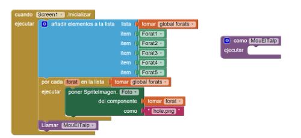
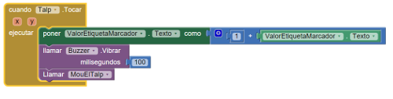

#Caça el Talp

Aquest tutorial us ensenyarà a construir un joc similar al famós joc arcade [Whac-A-Mole](https://en.wikipedia.org/wiki/Whac-A-Mole) (Caça el Talp). Per pantalla hi apareixen 5 forats des d'on surten aleatòriament talps. La vostra missió serà picar cada talp. Cada vegada que encerteu, sumareu un punt al marcador. Podeu trobar el guió complet d'aquesta pràctica en anglès [aquí](http://appinventor.mit.edu/explore/ai2/molemash-2.html).

##Què aprendreu?

1. Creació d'una llista de components
2. Control d'un joc amb el component "Reloj"
3. Utilització de les capes a l'hora de fer que un personatge surti a davant d'un altre per pantalla

##PAS 1: Comencem

1. Connecteu-vos a l'App Inventor i comenceu un nou projecte.
2. Poseu-li un títol apropiat (l'App Inventor no us deixarà fer servir el caràcter "ç").
3. Connecteu l'App Inventor al dispositiu mòbil.
4. Descarregueu-vos les imatges necessàries del joc: [mole.png](https://github.com/mdosil/AppInventor/blob/master/img/mole.png), [hole.png](https://github.com/mdosil/AppInventor/blob/master/img/hole.png)
5. Aneu al panell "Diseñador" i pugeu les imatges clicant a "medios".
6. Al component Screen poseu-li el títol "Caça el talp".

##PAS 2: Prepareu els components

L'interfície d'usuari tindrà un total de 6 personatges: 5 forats que no es mouen i 1 talp que apareixerà de dins d'algun dels forats. Heu de crear tots aquests personatges des del panell "Diseñador". Us posem amb una taula els elements que haureu de crear.

| **Tipus de Component** | **Grup a la paleta** | **Nom**              | **Funció del component**              |
| :--------------------- | :------------------- | :------------------- | :------------------------------------ |
| Lienzo                 | Dibujo y animación   | LlençdeJoc           | Camp de joc                           |
| SpriteImagen           | Dibujo y animación   | Forat1...Forat5      | Forats per on apareixerà el talp      |
| SpriteImagen           | Dibujo y animación   | Talp                 | El talp                               |
| DisposiciónHorizonal   | Posició              | PosicioMarcador      | Per a mostrar el marcador             |
| Etiqueta               | Interfaz de usuario  | TextEtiquetaMarcador | Hi posarem "Puntuació: "              |
| Etiqueta               | Interfaz de usuario  | ValorEtiquetaMarcador| Hi guardarem el valor de la puntuació |
| Reloj                  | Interfaz de usuario  | RellotgeTalp         | Per controlar el moviment del Talp    |
| So                     | Medios               | Buzzer               | Per vibrar quan toquem el talp        |

Seguidament, feu els canvis següents a les propietats de cada component:

| **Component**          | **Acció**                                                                                   |
| :--------------------- | :------------------------------------------------------------------------------------------ |
| LlençdeJoc             | Feu que el color de fons sigui verd. Feu que tingui una amplada i una alçada de 320 píxels  |                                                                                                                                                                                  |                        |                                                                                             |e
| Forat1                 | Feu x=20 i y=60 (cantonada superior esquerra)                                               |
| Forat2                 | Feu x=130 i y=60 (posició superior central)                                                 |
| Forat3                 | Feu x=240 i y=60 (cantonada superior dreta)                                                 |
| Forat4                 | Feu x=75 i y=140 (cantonada inferior esquerra)                                              |
| Forat5                 | Feu x=185 i y=140 (cantonada inferior dreta)                                                |
| Talp                   | Feu que la imatge sigui "mole.png". Feu que Z sigui 2 (i axí apareixerà davant del forat)   |
| TextEtiquetaMarcador   | Feu que el text sigui "Puntuació: ". Arrossegueu-lo dins del component DisposiciónHorizontal|
| ValorEtiquetaMarcador  | Feu que el text sigui "0". Arrossegueu-lo dins del component DisposiciónHorizontal          |

Quan hàgiu acabat d'afegir tots els elements per pantalla haureu de tenir quelcom similar a això:

##PAS 3: Afegir comportaments als components. Creació d'una variable.

Anem a l'editor de blocs. Primer de tot aneu al calaix "Variables" i creeu una variable global anomenada **forats**. Li donarem un valor inicial de prova d'una llista buida. Per fer-ho, obriu el calaix "Listas" i enganxeu al bloc anterior el bloc **crear una lista vacía**. Si voleu podeu afegir comentaris explicatius d'aquest bloc, això s'aconsegueix clicant el bloc amb el botó dret i seleccionant "Añadir comentario". Després us sortirà un interrogant i el podeu omplir amb el comentari.

##PAS 4: Comencem a programar l'App

Seleccionem l'element Screen1. El primer esdeveniment que es produeix en qualsevol programa s'anomena "Screen1.Inicializar". Per tant, arrossegarem el bloc **cuando Screen1.Inicializar ejecutar**. El que farem aquí és afegir els components dels forats a la llista, fixar cada forat a una imatge i cridar un procediment perquè el talp es comenci a moure.
Per omplir els elements de la llista amb els diferents forats, haureu de clicar la rodeta de la llista i arrossegar "elemento" dins de la llista fins a tenir-ne 5, un per a cada forat:

Per inicialitzar els forats amb la imatge ara afegirem el procediment **por cada forat en la lista ejecutar** a sota. Llavors com que volem posar la imatge "hole.png" a cada forat, obrirem el calaix "Cualquier componente" triarem "CualquierSpriteImagen" i arrossegarem el bloc de color verd **poner SpriteImagen.Foto del componente como**, tal i com mostrem a la figura. El bloc vermell "holes.png" està dins el calaix "Bloques Integrados / Texto". Escriviu-hi "hole.png" a dins.

Ara crearem un procediment buit que serà el que haurà de fer el programa per moure el talp, l'anomenarem **MouElTalp**. Obrim el calaix "Procedimientos" i arrossegueu el bloc **"como procedimiento ejecutar"**. Heu de modificar els blocs segons es mostra a la imatge següent, d'aquesta manera quan hàgim posat la imatge a cada forat, el talp ja estarà llest per començar a moure's.

##PAS 5: Moure el talp

Per moure el talp haurem d'omplir el procediment buit que hem creat que es diu MouElTalp. El cridarem quan comencem el programa, quan el Talp és tocat i quan el comptador de temps s'acabi. El que volem que faci és que trii un forat aleatori de la llista i que hi posi el talp a sobre. Aquí sota teniu la imatge dels blocs que heu de crear:

Ara li direm al programa que aquest procediment es cridi quan s'acaba el temps del rellotge RellotgeTalp. Necessitem només dos blocs per a fer això:

##PAS 6: Registrem el nombre de vegades que el jugador ha tocat el talp

Ara ens cal especificar què passa cada vegada que toquem el talp. Més concretament el que volem és:

1. Incrementar el marcador
2. Fer que el telèfon vibri breument
3. Moure el Talp

Traduït a blocs, ens cal implementar el següent:

Fixeu-vos que cridem el procediment MouElTalp quan el toquem perquè així agafi una nova posició.

##PAS7: Programa final

Aquí teniu tots el blocs del Programa

##Variacions

Aquí hi ha algunes variacions que podeu provar després d'implementar el programa:

1. Afegiu un botó de reset per fer que el comptador de punts torni a 0.
2. Fer que el comptador de punts depengui no només del nombre de vegades que toqueu el talp sinó que descompti punts cada vegada que us equivoqueu.
3. Augmenteu la velocitat del joc (rapidesa amb la que es mou el talp) si el jugador va guanyant i disminuïu-la si el jugador no suma gaires punts.
4. Afegiu un segon talp amb un temporitzador diferent.

##Resum

Aquí teniu les idees que s'han cobert amb aquest tutorial:

1. Posar components a dins d'una **Lista**.
2. Efectuar una operació per a cada component d'una **Lista** utilitzant el bloc **por cada en la lista**.
3. Situar un component **SpriteImagen** a sobre d'un altre fent servir la seva propietat **Z** per controlar qui va a davant.
4. Utilitzar el component **Reloj** per a controlar un joc.
5. Crear un procediment i cridar-lo en moments diferents del joc
