#I have a dream

Amb aquest tutorial construireu una app senzilla en qüestió de minuts. La guia original és en anglès i la podeu trobar [aquí](http://www.appinventor.org/apps2/IHaveADream/IHaveADream.pdf). Si us interessa també hi ha el [videotutorial](http://www.appinventor.org/content/CourseInABox/Intro/IHaveADream) (en anglès).

La pràctica conté dues parts:

1. La primera part consisteix en una foto del premi Nobel  [Martin Luther King](https://ca.wikipedia.org/wiki/Martin_Luther_King)(MLK) que al clicar-la fa que soni el [famós discurs](https://ca.wikipedia.org/wiki/Tinc_un_somni) que va fer davant de 250000 persones a les escales del memorial Lincoln el 1963.
2. En aquesta segona part afegireu una imatge de [Malcom X](https://ca.wikipedia.org/wiki/Malcolm_X) i farem el mateix: quan la cliqueu sonarà un dels seus discursos a favor dels drets humans. En aquesta part aprendreu a utilitzar els blocs condicionals.

Podeu acabar les dues parts en una hora aproximadament. Quan hàgiu acabat sereu capaços de construir apps amb so sobre qualsevol tema.


#PART 1: Discurs de Martin Luther King

###PAS 0: Objectiu de la app (part 1)

Aquesta és l'aparença que ha de tenir la vostra app *I have a dream*. Quan l'usuari cliqui la imatge, l'app farà sonar el discurs de Martin Luther King.

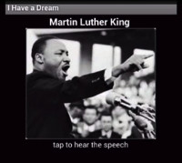

###PAS 1: Obrim el material necessari de la galeria d'App Inventor

Aneu a la web de l'App Inventor, [http://ai2.appinventor.mit.edu](http://ai2.appinventor.mit.edu). App Inventor té una galeria per a compartir apps. Obriu una altra pestanya amb el link: [http://ai2.appinventor.mit.edu/?galleryId=5753789846913024](http://ai2.appinventor.mit.edu/?galleryId=5753789846913024). Se us ha d'obrir *I Have a Dream Starter*. Canvieu-li el nom i traieu-li l'"Starter" per exemple. Els noms de les apps no poden tenir espais ni signes de puntuació.

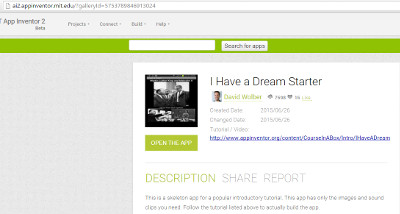


Cliqueu el botó *Open the app* i se us obrirà en el vostre compte App Inventor. Aquesta app no té codi però conté els fitxers d'imatge i so que seran necessaris per la vostra app, així no perdreu temps buscant-los per internet.

###PAS 2: Alinieu la pantalla

Quan tingueu oberta la pestanya del "Diseñador", haureu d'especificar quin aspecte tindrà la vostra App. Feu que la disposició horitzontal, "DispHorizontal" sigui centrada. Així quan afegiu imatges a la pantalla estaran centrades. Si mireu sota l'apartat "Medios" hi veureu els fitxers d'àudio i d'imatge carregades.

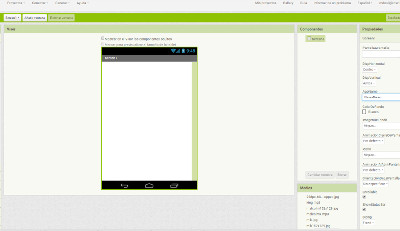

###PAS 3: Creeu un botó

Arrossegueu un botó a la pantalla. El botó us apareixerà amb un text per defecte. Ara el canviarem i també canviarem la imatge del botó. A la banda esquerra, a l'apartat de propietats, veureu que podeu seleccionar la imatge. Seleccioneu la imatge **mlk.jpg**. A l'apartat del text del botó canvieu-lo i poseu-hi **Martin Luther King**.

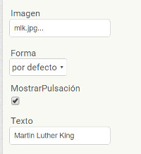

Ara haureu de veure el botó al mig de la pantalla amb la foto de'n Martin Luther King.

###PAS 4: Afegiu dues etiquetes a sobre i a sota el botó

Aneu a la paleta de la dreta, si sota "Interfaz de usuario" trobareu etiqueta. Arrossegueu-ne dues a la pantalla, una a sobre la imatge i l'altra a sota. A "Propiedades" feu que es mostrin.

Per a l'etiqueta de sobre, escriviu-hi el text **Martin Luther King**. A les propietats del text feu que tingui una mida de 20 pt i que es mostri en negreta.

Per a l'etiqueta de sota, escriviu-hi el text **Premeu la imatge per a sentir el discurs**.

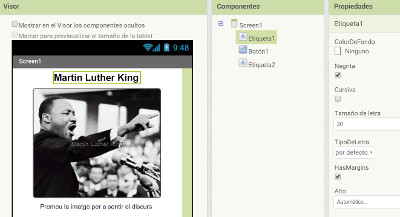

###PAS 5: Afegiu un component reproductor

Aneu a la paleta "Medios" i arrossegueu a la pantalla un component reproductor. A la dreta, on posa propietats, trieu com a origen d'àudio el fitxer **king.mp3**.

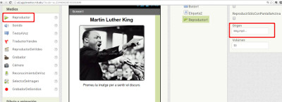

###PAS 6: Obriu l'editor de blocs per a programar

Fins aquí hem dissenyat la primera part de l'app. Ara falta programar-la. Cliqueu el botó "Bloques" a dalt a la dreta. Seleccioneu l'objecte "Botón1" i arrossegueu el tros de codi:

```
cuando Botón1.Clic
ejecutar
```

Ara programareu què passa quan es clica el botó. Si volem que al clicar la imatge soni el discurs de'n Martin Luther King, seleccionem l'objecte "Reproductor1" i arrosseguem a dins el bloc anterior el bloc:

```
llamar Reproductor1.Iniciar
```

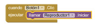

###PAS 7: Proveu la vostra app

Connecteu l'App Inventor amb el vostre dispositiu mòbil. Després d'escanejar el codi QR us ha de sortir la vostra app per pantalla. Si l'heu programada correctament, veureu que sona el discurs de Martin Luther King quan cliqueu el botó.

###PAS 8: Descarregueu-vos la vostra app a l'ordinador

La vostra app ara corre dins de l'AI2 Companion. Si el desconnecteu del VIFI però, l'app no funcionarà en el vostre dispositiu mòbil i no ho podreu enviar a un amic, per exemple. Torneu a la pantalla de disseny. A dalt de tot desplegueu el menú "Generar" i trieu l'opció "App (guardar Archivo .apk en mi ordenador)".

Un cop l'heu baixat el podeu enviar per correu com un arxiu adjunt, per exemple. Si voleu executar aquesta app en un mòbil, potser us caldrà canviar la configuració de seguretat per tal que el mòbil pugui executar apps que no provinguin del Play Store.


**Felicitats! Heu acabat la primera part.**


##PART 2: Afegim el discurs de'n Malcom X

###PAS 9: Afegiu un altre botó i un altre discurs

Com ja sabeu tant Martin Luther King com Malcom X eren activistes per els drets humans. Ara per fer-ho més divertit afegirem un botó amb el discurs de'n Malcom X, però serà més complicat perquè ens haurem d'assegurar que els discursos no es trepitgen.

Al menú superior desplegueu la pestanya "Proyectos" i trieu "Guardar proyecto como...". Anomeneu el vostre projecte amb un altre nom, per exemple "MLK_MalcomX".


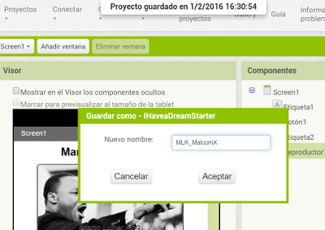

Aneu al panell de disseny i modifiqueu la interfície d'usuari. Primer canvieu el text de l'etiqueta superior perquè mencioni també a Malcom X. Després arrossegueu un segon botó per a Malcom X i poseu-hi la imatge **malcom152x129.jpg**. Llavors canvieu la imatge que teníeu de Martin Luther King per una imatge més petita, **mlk152x99.jpg**.

Fins aquí heu d'obtenir dos botons un a sobre l'altre. Però ens agradaria més tenir-los de costat. Per fer-ho, obriu l'apartat "Disposición" de la paleta i trieu l'objecte "Disposición Horizontal". Arrossegueu-lo al mig de la pantalla i arrossegueu després els dos botons a dins. Si ho heu fet correctament, ara us han de sortir els dos botons de costat.

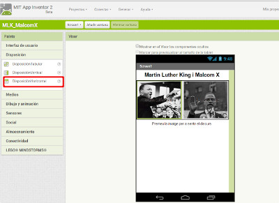

###PAS 10: Afegim la imatge d'ambós líders

Des de la paleta, a "Interfaz de usuario", escolliu un objecte "Imagen" i arrossegueu-lo a la pantalla. Col.loqueu-lo just sota del títol. En el menú de la dreta, a "Propiedades", en el camp "Foto" poseu-hi el fitxer **228px-MLK_and_Malcom_X_USNWR_cropped.jpg**. Fixeu-vos que la diferència d'una imatge i un botó és que no passarà res quan la cliquem.

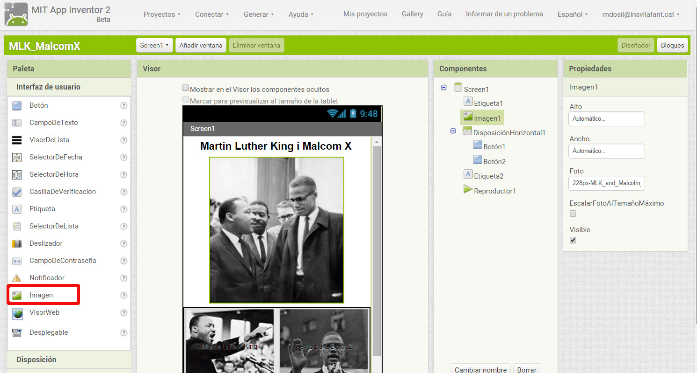


###PAS 11: Afegiu un segon reproductor

Arrossegueu un altre component reproductor a la pantalla i a "Propiedades/Origen" poseu-hi el fitxer**malcomx.mp3**. Canvieu els noms dels objectes botó i reproductor per tal que identifiquin clarament de quin personatge són. Per fer-ho, quan els tingueu seleccionats, cliqueu el botó "Cambiar nombre" en el menú "Componentes" que us surt a la dreta.

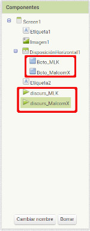


###PAS 12: Afegiu un títol a la pantalla i canvieu el color de fons

Per acabar la UI, feu que el color de fons sigui negre. Això ho trobareu al panell "Propiedades" de la dreta. Allà també hi podreu canviar el títol, poseu-hi, per exemple, "A Dream with no Name".

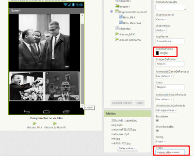

###PAS 13: Programeu el botó de Martin Luther King

Obriu l'editor de blocs. Veureu que el codi introduït abans s'ha renombrat al nom actual del botó, així com el dels reproductors. Seleccioneu el botó de'n Martin Luther King. El que volem ara és que el discurs comenci quan el cliquem per primera vegada però que es pausi quan el tornem a clicar. I si el tornem a clicar que continuï reproduint-se i així anar fent. Vaja, que no sempre voleu que passi el mateix quan cliquem el botó. Per a fer això utilitzarem el bloc de control:

```
si
entonces
```

Però l'haurem de preparar tal i com es mostra a la imatge:

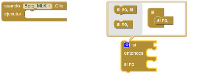

Ara ens fa falta preguntar si el discurs s'està reproduint. Si la resposta és sí, el pararem, i si és no, el reproduirem. També necessitarem el bloc:

```
discurs_MLK.Sonando
```

de l'objecte reproductor. Programeu-ho segons ho veieu a la imatge següent:

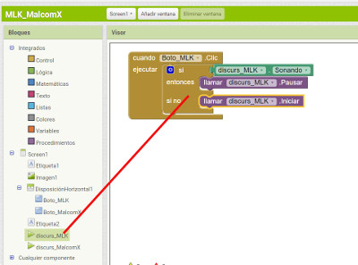


Amb aquest tros de codi veiem dues coses noves. El bloc condicional **si, si no** i estem provant diferents propietats dels components d'una app.

###PAS 14: Programeu que un discurs es pari quan l'altre estigui sonant

Finalment el que ens falta és fer que un discurs es pari si l'altre està sonant i viceversa. Així doncs cal que els blocs finals siguin:

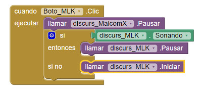


Creeu una còpia d'aquest mateix bloc. Ara en teniu dos d'iguals. Només haureu de canviar els noms perquè la App faci el mateix quan es cliqui el botó MalcomX.


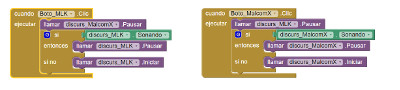

Connecteu ara el vostre mòbil i proveu la app. Us funciona? Així és com funciona l'arquitectura bàsica de moltes de les apps que existeixen.

###PAS 15: Reptes

Si heu acabat, podeu provar de contestar les preguntes i els reptes que se us proposen a [la pàgina web](http://www.appinventor.org/content/CourseInABox/Intro/IHaveDream) (en anglès).
