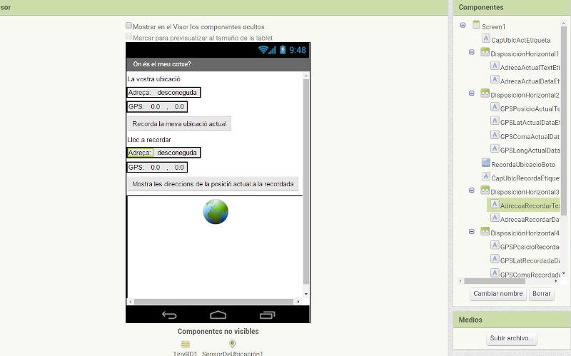
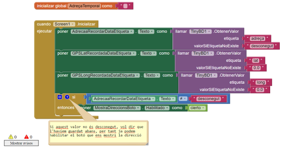
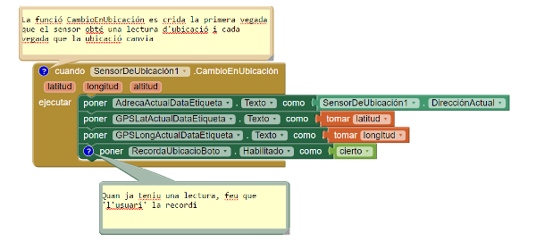
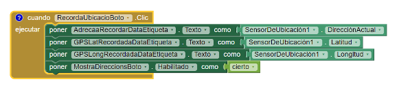
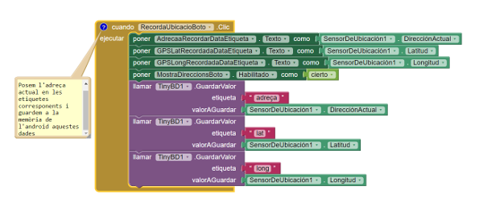
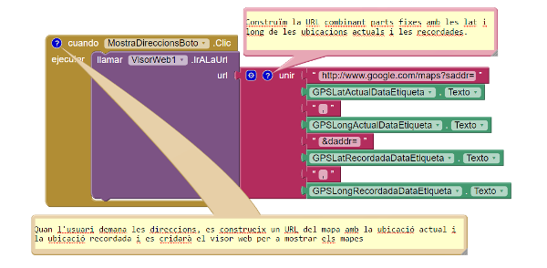

#On és el meu cotxe?

Avui aneu de concert. Heu aparcat tant aprop com heu pogut de l'estadi, però quan acaba el concert no us enrecordeu d'on heu deixat el cotxe i els vostres amics tampoc tenen molt bona memòria. Per sort, teniu el vostre Android a mà, amb l'App *On és el meu cotxe?* instal.lada. Amb auqesta app, només us farà falta clicar un botó quan aparqueu el cotxe i l'Android utilitzarà aquesta localització per guardar les coordenades GPS del vostre cotxe així com també l'adreça. Més tard, quan la torneu a obrir, us donarà les indicacions des d'on esteu fins on teniu el vehicle. I.. problema solucionat!

Podeu trobar també aquesta pràctica en anglès [aquí](http://appinventor.mit.edu/explore/ai2/android-wheres-my-car.html).

##Què aprendreu?

Aquesta app cobreix els conceptes següents:

1. Determinar la posició del dispositiu Android utilitzant el component **SensorDeUbicación**.
2. Guardar dades de manera *persistent* a una base de dades del nostre dispositiu Android mitjançant el component **TinyBD**  
2. Utilitzar el component **VisorWeb** per obrir el *Google Maps* des de la vostra app i mostrar el camí d'una localització a una altra.

##PAS 1: Comencem

Connecteu-vos a [l'Appinventor](http://appinventor.mit.edu/) i creeu un projecte nou. Els projectes ja sabeu que no poden contenir espais, per exemple, el podeu anomenar *OnEsElMeuCotxe*. Connecteu l'AI Companion per a començar a testejar-lo.

##PAS 2: Disseny dels components

La interfície d'usuari per aquesta app consisteix en una sèrie d'etiquetes per mostrar les ubicacions actuals i la ubicació que cal recordar (per exemple on hem deixat el cotxe). També tindrà botons que ens permetran guardar una localització concreta i mostrar els itineraris cap a ella.

Necessitareu alguns components que només mostrin text estàtic, com per exemple una etiqueta **GPSPosicioActualTextEtiqueta** que mostrarà el text *GPS:* que sortirà a l'interfície d'usuari. Altres etiquetes, com és ara l'etiqueta **GPSLatActualDataEtiqueta** mostrarà les dades del *SensorDeUbicación*. Per aquestes etiquetes els hi assignarem primer un valor per defecte, (0,0), que canviarà quan el GPS comenci a rebre dades de localització.

També faran falta 3 components no visibles, un **SensorDeUbicación** per obtenir la ubicació actual, un component **TinyDB** per guardar dades de manera persistent, i un component **VisorWeb** per mostrar els itineraris en el *Google Maps* entre la localització actual i la localització guardada. Podeu construir els components a partir de taula i la imatge que es mostra a continuació. Fixeu-vos amb el nom i sigueu ordenats, perquè si no això més endavant us pot dur problemes.

| Tipus de component     |  Nom que li posareu             | Funció                                                              |
| :----------------------| :-------------------------------| :-------------------------------------------------------------------|
| Etiqueta               |  CapUbicActEtiqueta             | Mostra el text: "La vostra ubicació" per pantalla                   |
| DisposiciónHorizontal  |  DisposiciónHorizontal1         | Conté les dues etiquetes que venen a continuació                    |
| Etiqueta               |  AdrecaActualTextEtiqueta       | Mostra el text: "Adreça: "                                          |
| Etiqueta               |  AdrecaActualDataEtiqueta       | Mostra el text: "desconegut " (inici)                               |
| DisposiciónHorizontal  |  DisposiciónHorizontal2         | Conté les 4 etiquetes que venen a continuació                       |
| Etiqueta               |  GPSPosicioActualTextEtiqueta   | Mostra el text: "GPS: "                                             |
| Etiqueta               |  GPSLatActualDataEtiqueta       | Mostra el text: "0.0" (inici) i després la latitud actual           |
| Etiqueta               |  GPSComaActualDataEtiqueta      | Mostra el text: ","                                                 |
| Etiqueta               |  GPSLongActualDataEtiqueta      | Mostra el text: "0.0" (inici) i després la longitud actual          |
| Botó                   |  RecordaUbicacioBoto            | Es prem per recordar la posició actual                              |
| Etiqueta               |  CapUbicRecordaEtiqueta         | Mostra el text: "Lloc a recordar" per pantalla                      |
| DisposiciónHorizontal  |  DisposiciónHorizontal3         | Conté les dues etiquetes que venen a continuació                    |
| Etiqueta               |  AdrecaaRecordarTextEtiqueta    | Mostra el text: "Adreça: "                                          |
| Etiqueta               |  AdrecaaRecordarDataEtiqueta    | Mostra el text: "desconegut " (inici)                               |
| DisposiciónHorizontal  |  DisposiciónHorizontal4         | Conté les 4 etiquetes que venen a continuació                       |
| Etiqueta               |  GPSPosicioRecordadaTextEtiqueta| Mostra el text: "GPS: "                                             |
| Etiqueta               |  GPSLatRecordadaDataEtiqueta    | Mostra el text: "0.0" (inici) i després la latitud recordada        |
| Etiqueta               |  GPSComaRecordadaDataEtiqueta   | Mostra el text: ","                                                 |
| Etiqueta               |  GPSLongRecordadaDataEtiqueta   | Mostra el text: "0.0" (inici) i després la longitud recordada       |
| Botó                   |  MostraDireccionsBoto           | Es prem per mostrar direccions de l'actual a la recordada           |
| VisorWeb               |  VisorWeb1                      | Mostrarà al google maps les direccions a la ubicació recordada      |
| TinyDB                 |  TinyDB1                        | Guarda a la memòria del mòbil la ubicació recordada                 |
| SensorDeUbicación      |  SensorDeUbicación1             | Envia les dades GPS                                                 |

##PAS 3: Inicialitzem l'aplicació

Primer de tot crearem una variable global temporal **AdreçaTemporal** que ens permetrà emmagatzemar el nom d'una adreça. A partir d'aquí, quan engeguem per primera vegada l'aplicació es poden donar 2 casos:

1. Que l'usuari obri l'aplicació per primera vegada, i en aquest cas no hi ha cap destinació emmagatzemada al telèfon.
2. Que l'usuari obri l'aplicació una segona o una altra vegada i que vulgui recordar una destinació guardada al telèfon prèviament.

En els blocs que trobareu a continuació es fa això. Fixeu-vos que en inicialitzar la pantalla es busca a la memòria del telèfon si hi ha alguna adreça guardada amb l'etiqueta *adreça* (més endavant veureu com guardem aquesta informació). Si no (valorSiEtiquetaNoExiste), vol dir que no tenim res guardat a la memòria i llavors donem al valor de l'adreça el text *desconegut*. El mateix fem per la latitud i la longitud.

Al final, comprovem si el text emmagatzemat de l'adreça recordada és diferent de *desconegut*. En cas afirmatiu, voldrà dir que hem guardat una adreça prèviament, i llavors habilitarem el botó que ens mostra la direcció.

##PAS 4: Mostrem l'adreça actual

L'esdeveniment **SensorDeUbicación1.CambioEnUbicación** no només s'activa quan canviem la ubicació del dispositiu mòbil però també quan el sensor s'engega per primera vegada. A vegades triga uns segons a agafar dades un cop s'engega, i sovint no agafa cap dada si la senyal al GPS és molt dèbil (per exemple si esteu dins d'un edifici).

Un cop agafem una lectura de GPS, li hem de dir a la nostra app que la posi en les etiquetes corresponents. A continuació trobareu els blocs que fan tot això.

**Proveu la vostra app**

Segurament per provar-la haureu de sortir a fora i caminar una miqueta. Per tant, no es pot provar amb l'AI Companion, sinó que haureu de generar l'arxiu .apk i instal.lar-lo al vostre mòbil.
Quan correu l'app haureu de veure que apareixen algunes dades GPS i també que el botó **RecordaUbicacioBoto** està habilitat. Si no obteniu cap lectura d'ubicació, reviseu les opcions del vostre Android a l'apartat *Ubicació i seguretat*.

##PAS 5: Emmagatzemem la ubicació actual

Quan l'usuari clica el botó **RecordaUbicacioBoto**, aquestes dades d'ubicació (adreça, latitud i longitud) han d'aparèixer a les etiquetes que hem creat per guardar-les. Anem a programar aquests blocs.

Veureu que amb aquests blocs activem el botó **MostraDireccionsBoto**. Això pot ser una mica complicat, perquè si l'usuari clica el botó immediatament, l'adreça recordada serà la mateixa que l'adreça actual, i el mapa no mostrarà possibles direccions. Però això és una cosa que rarament pot fer l'usuari ja que quan aquest es mou (per exemple va caminant cap al concert) la ubicació actual i la ubicació a recordar seran diferents.

**Proveu la vostra app**

Baixeu-vos la nova versió de la vostra app al mòbil i proveu-la una altra vegada. Quan cliqueu el botó  **MostraDireccionsBoto** es copien les dades de la ubicació actual a la ubicació recordada?

El que volem nosaltres però és guardar de manera *persistent* (això és, a la memòria del mòbil) la ubicació que desitgem recordar. Per fer-ho caldrà modificar una miqueta els blocs que hem escrit. El que volem exactament és que si recordem una ubicació, tanquem la app i la tornem a obrir, aquesta ubicació estigui emmagatzemada a la memòria del mòbil. Aquest seria el cas quan per exemple anem a un concert, aparquem, recordem la ubicació del cotxe i quan s'acaba el concert, tornem a encendre l'aplicació perquè ens mostri com anar altra vegada al nostre cotxe.

Per emmagatzemar dades de manera persistent al telèfon haurem d'utilitzar l'element *TinyDB*. Seguirem l'esquema següent:

1. Quan l'usuari clica el botó **RecordaUbicacioBoto**, la ubicació s'ha de guardar a la base de dades del nostre Android.
2. Quan s'engega l'aplicació, aquesta ubicació s'ha de carregar de la base de dades i posar-la en una de les etiquetes (aquesta part ja l'hem programada en el **PAS 3**).

Haureu de **modificar** doncs l'últim bloc de codi perquè sigui com aquest:

Si us hi fixeu, la funció **TinyDB1.GuardarValor** copia les dades d'ubicació des del **SensorDeUbicación** a la base de dades. L'etiqueta identifica les dades que es volen emmagatzemar, així, quan les necessitem posteriorment, les cridarem per la seva etiqueta.

##PAS 6: Mostrar el camí cap a la ubicació recordada

Finalment el que volem és que quan l'usuari premi el botó **MostrarDireccionsBoto** s'obri el *Google Maps* i que ens mostri els diferents camins des de la nostra ubicació fins a la ubicació recordada (per exemple, on tenim el cotxe aparcat).

El component **VisorWeb** ens mostra qualsevol pàgina web, inclòs el Google Maps. Cridarem la funció **VisorWeb.IrALaURL** perquè ens mostri el camí des de l'ubicació actual fins a la ubicació recordada.

Una manera de mostrar ubicacions al Google Maps és amb una URL que tingui la forma següent:

[https://www.google.com/maps?saddr=37.82557,-122.47898&daddr=37.81079,-122.47710](https://www.google.com/maps?saddr=37.82557,-122.47898&daddr=37.81079,-122.47710)

Poseu aquesta adreça en el navegador: a quina localització famosa pertany ;-)?

Per aquesta app necessitareu construir la URL i posar la localització actual (*saddr*) i la seva destinació (*daddr*) de manera dinàmica en els blocs. En pràctiques anteriors ja heu ajuntat text utilitzant la funció **unir**, aquí també farem això per unir les ubicacions GPS recordada i l'actual. Posarem l'adreça que heu construït dins del paràmetre de la funció **VisorWeb.IrALaURL**. A continuació teniu els blocs que haureu de crear.

**Proveu la vostra app**

Baixeu-vos la nova versió de l'app al vostre dispositiu Android i proveu-la una altra vegada. Quan tingueu dades GPS, premeu el botó *Recorda la meva ubicació actual* i camineu una estona. Quan cliqueu el botó *Mostra les direccions de la posició actual a la recordada* us mostra el mapa com heu de tornar al punt d'inici? Després de mirar el mapa, cliqueu el botó enrera del dispositiu unes quantes vegades. Torneu a la vostra app?

##Variacions

Aquí us donem algunes idees per si voleu experimentar més:

1. Creeu una app anomenada *On és tothom?*. L'app servirà per a rastrejar on està un grup de gent que comença junta i després es separa. Mentre esteu caminant per la muntanya o us separeu del grup en un passeig per la ciutat, aquesta app us pot estalviar temps i fins i tot potser la vida. Podeu compartir la vostra ubicació utilitzant el component *TinyWebDB* enlloc del component *TinyDB*.

2. Podeu organitzar una *cacera de tresors*. Imagineu que amagueu uns objectes en unes ubicacions determinades i guardeu aquestes ubicacions en una *llista*. Després podeu construir una app que us mostri el camí a cadascuna de les ubicacions dels objectes que heu amagat.

##Resum

Aquí hi ha els aspectes que hem cobert amb aquesta pràctica:

1. El component **SensorDeUbicación** ens dóna la latitud, la longitud i l'adreça actual d'un usuari. L'esdeveniment **SensorDeUbicación.CambioEnUbicación** s'encén quan el sensor llegeix per primera vegada les dades d'una ubicació i quan la lectura de la ubicació canvia (això és, quan ens movem amb el nostre dispositiu).
2. El component **VisorWeb** ens mostra qualsevol pàgina web, Google Maps inclòs. Si volem mostrar un camí entre dues localitzacions GPS, l'URL ha de tenir el format següent: *https://www.google.com/maps?saddr=0.1,0.1&daddr=0.1,0.1*
3. Hem utilitzat **unir** per a concatenar textos separats en un de sol. Podem concatenar textos dinàmics (dades d'ubicació recollides en temps real) amb textos estàtics.
4. Amb el component **TinyDB** podem emmagatzemar dades de manera persistent en el nostre mòbil. Si emmagatzemem dades en una variable o propietat, aquestes dades es perden quan apaguem la nostra app, però si ho guardem amb el component **TinyDB**, podem accedir a aquestes dades cada vegada que tornem a obrir l'app.
