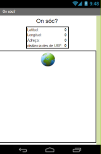
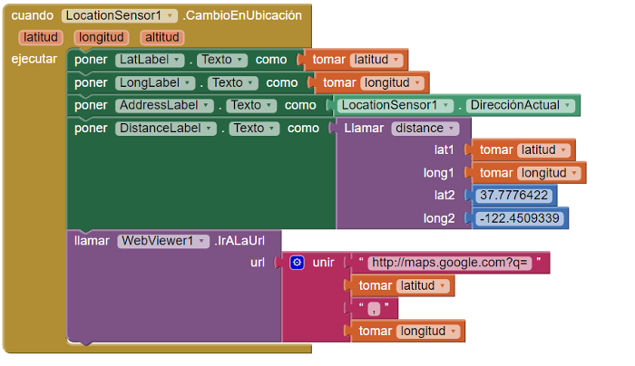
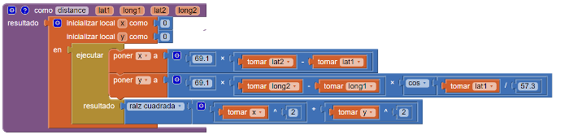

#On sóc?

L'objectiu de l'app que desenvolupareu amb aquest projecte és trobar la distància en metres que us trobeu d'una localització concreta, per exemple, de l'Institut de Vilafant. Abans de començar a programar l'app, ens caldrà repassar quatre conceptes sobre què són les coordenades GPS i com es mesuren distàncies sobre l'esfera terrestre.

Podeu trobar també una part d' aquesta pràctica en anglès [aquí](http://www.appinventor.org/content/CourseInABox/textingLocation/WhereAmI).

##Què aprendreu?

1. Utilització del component **SensorDeUbicación** per a determinar les coordenades GPS d'on ens trobem.
2. Càlcul de distàncies terrestres a partir de les coordenades GPS de dues localitzacions determinades.

##PAS 1: Com determinem sobre la terra un punt de manera exacta? Distàncies sobre l'esfera terrestre.

Per a determinar unívocament la localització d'un punt sobre l'esfera terrestre fem servir els termes **latitud** i **longitud**:

* La [latitud](https://ca.wikipedia.org/wiki/Latitud) és la distància angular entre una localització terrestre i l'Equador. Els punts sobre l'equador tenen latitud 0, el pol nord té latitud 90N i el pol sud 90S.
* La [longitud](https://ca.wikipedia.org/wiki/Longitud_(geografia)) és la distància angular entre una localització terrestre i el [meridià de Greenwich](https://ca.wikipedia.org/wiki/Meridi%C3%A0_de_Greenwich). Els punts que són sobre el meridià tenen longitud 0, i els valors possibles de longitud oscil.len entre +180 graus de latitud est fins a -180 graus de latitud oest.

Des de l'antiguitat s'utilitzen mapes per a representar l'esfera terrestre. Això fa que calgui fer una **projecció** de l'esfera terrestre sobre una superfície plana. Hi ha diferents [tipus de projeccions](https://ca.wikipedia.org/wiki/Projecci%C3%B3_cartogr%C3%A0fica) i cadascuna introdueix algunes *aproximacions* a la representació de la terra sobre una superfície plana.

Dit això, per calcular una distància entre 2 punts sobre l'esfera terrestre es poden fer servir vàries aproximacions depenent si els dos punts estan molt allunyats o són molt propers. Fent servir la [projecció equirectangular](https://en.wikipedia.org/wiki/Equirectangular_projection) les coordenades cartesianes x i y es poden representar fàcilment en funció de la latitud i la longitud d'un punt donat. Aquesta aproximació és la que farem servir nosaltres.

En [aquest enllaç](http://geokoder.com/distances) hi podreu trobar altres maneres de calcular la distància entre 2 punts de l'esfera terrestre.

##PAS 2: Com es pot mostrar amb App Inventor la teva latitud, longitud i adreça?

A l'App Inventor hi ha un component que s'anomena **SensorDeUbicación**. Aquest component ens dóna la localització gps (latitud i longitud) d'on estem sempre i quant tinguem el GPS del mòbil activat. Per exemple, la funció **SensorDeUbicación.cambioEnUbicación** s'activarà quan:

1. Quan l'app s'engegui per primera vegada i prengui una lectura del GPS
2. Quan canvii la localització del mòbil

Per exemple, si esteu caminant, l'activarà moltes vegades. Podreu ajustar quan s'activa amb les propietats **SensorDeUbicación.IntervaloDeDistancia** i  **SensorDeUbicación.IntervaloDeLocalización** del panell de disseny. Per defecte, l'interval de temps amb el qual s'actualitza la posició està posat a 60.000 ms o 1 minut.

##PAS 3: Com es pot saber amb App Inventor la distància a la qual ens trobem d'un punt determinat?

L'App Inventor no té un component *distància* per a calcular la distància entre dues coordenades GPS. Però hi ha fòrmules matemàtiques conegudes per aproximar aquesta distància entre 2 punts. La solució serà crear els vostres propis blocs i enganxar-los amb les fòrmules matemàtiques adients. Tal i com hem dit més amunt, la funció distància que utilitzarem aquí s'ha extret d'aquest [enllaç](http://geokoder.com/distances). En aquest cas, es calcula la distància entre dos punts expressada en **milles** (recordeu, 1 milla=1609 m).

##PAS 4: l'App on sóc?

L'app que us mostrem a continuació dóna la distància aproximada en **milles** que ens trobem del campus de [la Universitat de Sant Francisco (USF)](https://www.usfca.edu/). Intenteu implementar els blocs.

**Proveu la vostra app**
Un cop teniu programada l'app, sortiu a fora l'edifici, activeu el gps i assegureu-vos que us dóna la localització on us trobeu i la distància al campus de la universitat de Sant Francisco.

##PAS 5: Modifiquem l'App per a trobar la distància en metres que ens trobem del nostre Institut

Aquesta vegada ja us hem donat una app ja feta i volem que la modifiqueu per a personalitzar-la al nostre entorn. Mireu-vos bé el codi i els enllaços que us hem facilitat. Haureu de fer el següent:

1. Modificar l'app perquè us doni les distàncies en km enlloc de milles (per fer això haureu de saber quants km comprèn un canvi de latitud d'un grau, per exemple).
2. Modificar l'app perquè us doni la distància que us trobeu de l'Institut de Vilafant.

## Activitats a realitzar:

1. Proveu primer l'app tal i com se us mostra a l'exemple. Quan us funcioni deseu-la i publiqueu-la tal i com heu fet amb les apps anteriors.
2. Modifiqueu l'app perquè calculi les distàncies en km. Expliqueu a la vostra web com ho heu fet i publiqueu els fitxers (.aia i .apk) també a la vostra web.
3. Torneu a modificar l'app perquè calculi la distància en km que us trobeu de l'institut de Vilafant. Expliqueu a la vostra web com ho heu fet i publiqueu els fitxers (.aia i .apk) també a la vostra web.

**Proveu la vostra app**
Un cop teniu programada l'app, sortiu a fora l'edifici, activeu el gps i assegureu-vos que us dóna la localització on us trobeu en **km** i que la distància que us trobeu de l'institut de Vilafant més o menys és correcta.
