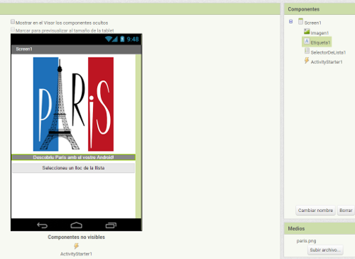
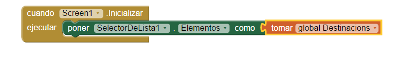
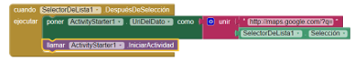
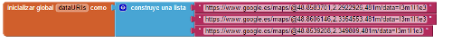
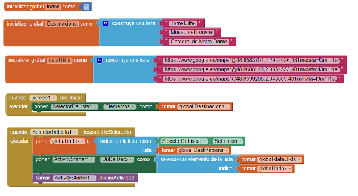

#Paris Map Tour

Aquests tutorial us permetrà construir una app per crear un itinerari turístic a la ciutat de París. Com que els vostres amics no us poden acompanyar en aquest fantàstic viatge, creareu una app suplementària que els permeti fer un tour virtual per aquesta ciutat.

Crear una app amb un mapa i que funcioni perfectament pot semblar complicat, però l'App Inventor utilitza un component que es diu *ActivityStarter* que ens permetrà llançar el *Google Maps* per a cada localització virtual.

Primer de tot creareu una app que mostri mapes per la Torre Eiffel, el museu del Louvre i la catedral de Notre Dame, només amb un clic. Després modificareu l'app per crear un tour virtual fet amb mapes de satèl.lit, també disponibles amb Google Maps.

Podeu trobar també aquesta pràctica en anglès [aquí](http://www.appinventor.org/MapTour2).

##Què aprendreu?

1. Utilització del component **ActivityStarter** per a llançar apps d'Android des de la vostra app. Utilitzarem aquest component per a cridar el Google Maps amb diferents paràmetres.
2. Utilització del component **SelectorDeLista** que permetrà a l'usuari triar una localització d'una llista.

##PAS 1: Disseny dels components

Creeu un projecte nou a l'App Inventor i anomeneu-lo *ParisMapTour*. La interfície d'usuari tindrà un component **Imagen** amb una foto de París (trieu-ne una que us agradi), un component **Etiqueta** amb el text "Descobriu París amb el vostre Android!", un component **SelectorDeLista** amb un botó associat i el text "Seleccioneu un lloc de la llista" i un component no visible **ActivityStarter**.

| Tipus de component  | Grup                 | Nom que li posareu   | Objectiu                                                 |
| :-------------------| :------------------- | :--------------------| :--------------------------------------------------------|
| Imagen              | Interfaz de usuario  | Imagen1              | Mostrar una imatge estàtica de París per pantalla        |
| Etiqueta            | Interfaz de usuario  | Etiqueta1            | Mostrar el text: "Descobriu París amb el vostre Android!"|
| Selector de Lista   | Interfaz de usuario  | SelectorDeLista      | Mosrar la llista de llocs per escollir                   |
| ActivityStarter     | Conectividad         | ActivityStarter1     | Llançar Google Maps un cop triada la destinació          |

Podeu dissenyar els components d'acord amb els de la figura següent:

##PAS 2: Definir les propietats de l'ActivityStarter

Aquest component us permetrà llançar qualsevol app Android, per exemple un navegador, Google Maps o qualsevol aplicació que tingueu instal.lada al vostre Android. Quan un usuari llança una aplicació externa des de la seva, sempre pot clicar el botó *enrere* per a retornar a la weva app. Construireu l'app ParisMapTour de tal manera que l'aplicació del Google Maps es llança per a mostrar mapes particulars basats en la tria de l'usuari. L'usuari llavors pot clicar el botó enrere per a retornar a la vostra app i seleccionar una destinació diferent.

L'ActivityStarter és un component *low-level* en el qual haureu de definir unes quantes propietats que són molt familiars als desenvolupadors de *Java Android SDK* però que són extranyes per a la resta de gent. Per aquesta app, entreu **exactament** les propietats que es llisten a la taula següent, però sigueu molt curosos perquè canvis en lletres majúscules/minúscules poden portar a errors.

| Propietat de l'ActivityManager  | Valor                                |
| :-------------------------------| :----------------------------------- |
| Acción                          | android.intent.action.VIEW           |
| Clase                           | com.google.android.maps.MapsActivity |
| Paquete                         | com.google.andropid.apps.maps        |

Un cop a l'editor de blocs definireu també una altra propietat **UriDelDato**, que us permetrà llançar un mapa específic de Google Maps. Aquesta propietat s'ha de fixar dins l'editor de blocs enlloc del panell de disseny perquè és dinàmica i canviarà en funció de que l'usuari trii la Torre Eiffel, el museu del Louvre o la catedral de Notre Dame.

##PAS 3: Programem els components

En l'editor de blocs haureu de definir una llista de destinacions i dos comportaments:

* Quan s'executi l'app, aquesta carregarà les destinacions al component SelectorDeLista i així l'usuari en podrà triar una.
* Quan l'usuari trii una destinació del SelectorDeLista, l'aplicació de Google Maps es llançarà i mostrarà el mapa de la destinació. En aquesta primera versió, només s'obrirà el Maps i l'usuari li dirà que busqui la destinació seleccionada.

##PAS 4: Creem una llista de destinacions

Obriu l'editor de blocs i creeu una variable amb la llista de destinacions de París utilitzant els blocs que es mostren a la taula següent:

| Tipus de bloc                        | Grup                 | Funció                                           |
| :------------------------------------| :------------------- | :------------------------------------------------|
| Definició de variable "Destinacions" | Definicions          | Crear una llista de destinacions                 |
| Construye una lista                  | Lista                | Afegir elements a la llista                      |
| Texto ("Torre Eiffel")               | Texto                | La primera destinació                            |
| Texto ("Museu del Louvre")           | Texto                | La segona destinació                             |
| Texto ("Catedral de Notre Dame")     | Texto                | La tercera destinació                            |

La variable **Destinacions** cridarà la funció **crear una lista** on hi podreu enganxar els valors del text de les 3 destinacions del vostre tour, tal i com es mostra a la imatge següent:

##PAS 5: Fer que l'usuari pugui triar una destinació

La funció del component SelectorDeLista és mostrar una llista d'ítems per tal que l'usuari en trii un. Vosaltres carregareu les opcions al component SelectorDeLlista quan fixeu la propietat **Elementos** de la llista. Per aquesta app, volem que aquesta propietat contingui la llista de destinacions que acabem de crear. Com que volem que es mostri aquesta llista just quan comenci la nostra app, això haurem de definir-ho en l'esdeveniment **Screen1.Inicializar**. Necessitareu els blocs que es llisten a la taula següent:

| Tipus de bloc              | Grup                 | Funció                                                         |
| :--------------------------| :------------------- | :--------------------------------------------------------------|
| Screen1.Inicializar        | Screen1              | Esdeveniment llançat quan l'app comença                        |
| poner SelectorDeLista1 a   | SelectorDeLista1     | Definiu aquesta propietat com la llista que voleu que aparegui |
| tomar global Destinacions  | Variables            | La llista de destinacions                                      |

Per a fer-ho, haureu de construir els blocs següents:

**Proveu la vostra app**

Primer de tot haureu de fer un reset a la connexió amb l'AI Companion. Llavors, amb el dispositiu mòbil cliqueu el botó "Trieu una destinació". Per pantalla us ha d'aparèixer la llista de destinacions.

##PAS 6: Obrir el Google Maps amb una destinació

Ara el que fareu serà programar l'app de tal manera que quan l'usuari trii una de les destinacions, l'**Activity Starter** llanci el Google Maps i busqui la destinació desitjada.

Quan l'usuari tria un element del component SelectorDeLista, es crida l'esdeveniment **SelectorDeLista.DespuésDeSelección**. En l'event handler pel component AfterPicking, hem de fixar el **UriDelDato** del component ActivityStarter de tal manera que aquest sàpiga quin mapa ha d'obrir, i llavors heu de llançar el Google Maps utilitzant el **ActivityStarter.LlamarActividad**. Els blocs d'aquestsa funcionalitat es llisten a la taula següent:

| Tipus de bloc                       | Grup                 | Funció                                                               |
| :-----------------------------------| :------------------- | :--------------------------------------------------------------------|
| SelectorDeLista1.DespuésDeSelección | SelectorDeLista1     | Esdeveniment llançat quan l'usuari fa una tria del SelectorDeLista   |
| poner ActivityStarter1.UriDelDato a | ActivityStarter1     | L'UriDelDato diu a Google Maps quin mapa ha de llançar               |
| unir                                | Texto                | Construir UriDelDato a partir de dues peces de text                  |
| texto("...")                        | Texto                | La primera part de UriDelDato que espera Google Maps                 |
| SelectorDeLista1.Selección          | SelectorDeLista1     | La destinació que tria l'usuari                                      |
| ActivityStarter1.LlamarActividad    | ActivityStarter1     | Llança l'aplicació de Google Maps                                    |

###Com funcionen els blocs

Quan l'usuari fa una tria del *SelectorDeLista*, l'item desitjat es guarda a l'element *SelectorDeLista.Selección* i es crida l'esdeveniment *DespuésDeSelección*. Tal i com es mostra a la figura següent, la propietat *UriDelDato* queda fixada a un text que combina "http://maps.google.com/?q=" amb l'element de la llista seleccionat. Per tant, si l'usuari tria el primer element, "Torre Eiffel", la propietat *UriDelDato* queda fixada a "http://maps.google.com/?q=Torre Eiffel". Com que a més a més ja heu fixat les altres propietats de l'*ActivityStarter* de tal manera que sap que ha d'obrir Google Maps, l'*ActivityStarter.LlamarActividad* ja sap que ha d'obrir Google maps i llança la busca amb l'argument guardat a la propietat *UriDelDato*.

Els blocs que heu d'afegir ara són els següents:

**Proveu la vostra app**

Reinicieu l'app i cliqueu el botó "Tria una destinació". Un com l'heu triada, se us obre el Google Maps  amb el mapa de la destinació triada? A més a més el Google Maps us ha de mostrar un botó per anar enrera. Funciona?

##PAS 7: Preparar un tour virtual

Anem a millorar una mica més la nostra app i afegim-hi algun zoom d'algun monument i l'Street View i així els amics que estiguin a casa us podran seguir mentre estigueu fora. Per fer això, primer haureu d'explorar el Google Maps per obtenir els URLs d'alguns mapes específics. Encara fareu servir les destinacions anteriorment creades, però ara quan l'usuari en trii una, utilitzareu l'índex que ocupa (posició a la llista, per entendre'ns) per seleccionar d'obrir una zona seleccionada del mapa o l'Street View.

Abans de continuar potser voleu guardar el vostre projecte (utilitzant *Proyectos/ Guardar proyecto como*) i així conserveu una còpia del que heu creat fins ara. Així, si cometeu algun error, sempre podreu tirar enrera.

##PAS 8: Trobar l'UriDelDato per a mapes específics

La primera cosa que heu de fer é obrir el Google Maps al vostre ordinador per a trobar el mapa espacífic que voleu llançar per a cada destinació:

1. Obriu amb el navegador [http://maps.google.com](http://maps.google.com)
2. Busqueu un monument concret (per exemple, la Torre Eiffel)
3. Feu-hi el zoom desitjat
4. Trieu el tipus de vista que voleu (adreça, satèl.lit o Street View)
5. Copieu l'URL del mapa. L'utilitzareu (o n'utilitzareu una part) per a llançar el mapa des de la vostra app

Utilitzant aquestes pautes, la taula següent us mostra les URLs que podeu utilitzar:

| Monument               | URL de Google Maps                                                  |
|:-----------------------|:--------------------------------------------------------------------|
| Torre Eiffel           | https://www.google.es/maps/@48.8583701,2.2922926,481m/data=!3m1!1e3 |
| Museu del Louvre       | https://www.google.es/maps/@48.8606146,2.3354553,481m/data=!3m1!1e3 |
| Catedral de Notre Dame | https://www.google.es/maps/@48.8539208,2.349809,481m/data=!3m1!1e3  |

Per a utilitzar qualsevol d'aquests URLs només les heu de copiar i enganxar al vostre navegador. Les podeu utilitzar directament o si voleu definir d'una manera més neta els URLs podeu utilitzar els protocols de Google Maps que s'especifiquen a [http://mashupguide.net/1.0/html/ch02s05.xhtml](http://mashupguide.net/1.0/html/ch02s05.xhtml). Per exemple, podeu obtenir el mapa de la Torre Eiffel posant-hi només les coordenades gps: https://www.google.es/maps/@48.8583701,2.2922926,17z .

##PAS 9: Definim la Llista dataURIs

Necessitareu ara una llista anomenada *dataURIs* que contingui els *UriDelDato* per a cada mapa que vulgueu mostrar. Creeu aquesta llista tal i com es mostra a la figura següent de tal manera que cada element de la llista correspon a un element a la llista de destinacions (per exemple, el primer element s'ha de correspondre amb la primera destinació, la torre Eiffel).

##PAS 10: Modifiquem el comportament del SelectorDeLista.DespuésDeSelección

En la primera versió de la nostra app, el comportament del *SelectorDeLista.DespuésDeSelección* donava a *UriDelDato* el valor d'ajuntar dos textos, "http://maps.google.com/?=" i la destinació que l'usuari triava de la llista (per exemple la torre Eiffel). En aquesta segona versió, això ho farem més sofisticat, perquè l'usuari tria d'una llista (*Destinacions*), però el *UriDelDato* s'ha de fixar a un altre element d'una altra llista (*dataURIs*). Més concretament, quan l'usuari tria un ítem del *SelectorDeLista*, haurem de saber **l'índex** de l'element del *SelectorDeLista* i fer que aquest índex sigui el de l'element de la segona llista, *dataURIs*. Explicarem més endavant què és l'índex d'una llista, però construirem primer els blocs de codi necessaris per a il.lustrar-ho millor. A la taula següent podeu veure els blocs de codi que necessitarem.

| Tipus de bloc                       | Grup                 | Funció                                                               |
| :-----------------------------------| :------------------- | :--------------------------------------------------------------------|
| global Destinacions                 | Variables            | La llista de llocs per visitar                                       |
| global DataURIs                     | Variables            | La llista de DataURIs                                                |
| global index                        | Variables            | Guarda la posició de l'element seleccionat                           |
| Def variable "index"                | Variables            | Variable que emmagatzemarà l'index de la tria que faci l'usuari      |
| número (1)                          | Matemáticas          | Inicialitzar la variable index a 1                                   |
| SelectorDeLista1.Selección          | SelectorDeLista1     | La destinació que tria l'usuari                                      |
| SelectorDeLista1.DespuésDeSelección | Lista                | S'executa després que l'usuari hagi fet una tria d'una llista        |
| índice en lista                     | Lista                | Obtenir la posició (índex) la la llista de l'element seleccionat     |
| poner ActivityStarter1.UriDelDato   | ActivityStarter      | Inicialitzar això abans de començar l'activitat per a obrir el mapa  |
| seleccionar elemento de lista       | Lista                | Seleccionar un element de la llista dataURIs                         |
| ActivityStarter1.LlamarActividad    | ActivityStarter1     | Llança l'aplicació de Google Maps                                    |

##PAS 11: Implementem els blocs

Quan l'usuari tria un ítem del *SelectorDeLista*, l'esdeveniment *DespuésDeSelección* és cridat. L'element que l'usuari tria (per exemple, la torre Eiffel) es guarda en *SelectorDeLista.Selección*. L'event handler fa servir això per a trobar la posició de l'element seleccionat o el valor de l'*index*, a la llista de Destinacions. L'índex correspon a la posició triada de la llista. Per tant, si triem la torre Eiffel, l'índex serà 1, si triem el museu del Louvre, serà 2 i si triem la catedral del Notre Dame, serà 3. A la figura següent hi podeu veure tots els blocs implementats.

**Proveu la vostra app**

Torneu a triar cada destinació. Obteniu el mapa desitjat?

##Ampliacions

1. Podeu afegir més destinacions de París a la vostra app, com per exemple el Moulin Rouge, o el palau de Versalles.
2. Afegiu efectes de so a la vostra app.
3. Creeu un tour virtual sobre alguna altra destinació exòtica, o sobre el vostre institut.
4. Si us agraden els reptes, creeu un tour virtual que sigui personalitzable:
    * Permeteu que l'usuari crei una guia per a una destinació que trii juntament amb un URL del mapa corresponent.
    * Haureu de guardar aquesta informació de manera persistent a la base de dades **TinyWebDB** i crear un tour virtual que funcioni amb la destinació triada. Per a trobar un exemple de com utilitar la base de dades **TinyWebDB** mireu-vos [aquest enllaç](http://www.appinventor.org/content/CourseInABox/textingLocation/PersistenceNugget) (anglès).
