#Pong


Aquest tutorial us ensenyarà a construir un joc similar al famós joc arcade [Pong](http://www.ponggame.org/) creat per Atari el 1972. Vosaltres construireu la versió bàsica, tindreu una pilota que rebotarà a les 4 parets del mòbil i també hi haurà una plataforma mòbil a la part inferior sobre la qual haurà de botar la pilota sense que toqui a terra. La versió bàsica no tindrà ni marcador i el joc no tindrà un final. Però un cop l'hàgiu acabat podreu afegir-hi vosaltres mateixos aquests elements:

* Marcador amb la puntuació
* Acabar el joc quan la pilota toca el terra
* Afegir 3 vides a la pilota
* Afegir efectes de so


 Podeu trobar els videotutorials complets d'aquesta pràctica en anglès [aquí](http://www.appinventor.org/content/CourseInABox/drawAnimate/PongTutorial).


##Què aprendreu?

1. Instruccions condicionals **si entonces**, **si si no**
2. Instruccions condicionals encadenades
3. Moviment d'un component Pelota o SpriteImagen dins d'un component Lienzo


##PAS 1: Comencem

1. Connecteu-vos a l'App Inventor.
2. Descarregueu-vos el fitxer [PongBasic.aia](https://github.com/mdosil/AppInventor/blob/master/aia/PongBasic.aia)
3. Aneu a "Mis Proyectos" i seleccioneu "Importar proyecto (.aia) des de mi ordenador". Pugeu aquest fitxer.
4. Heu de veure un projecte anomenat **Pong Basic**. Canvieu-li el nom a **Pong_nomcognom**.


##PAS 2: Elements del joc Pong

Suposo que haureu vist que la plantilla del joc ja té varis elements creats: una etiqueta (LabelStart) dos botons (ButtonStart i ButtonReset), un element HorizontalArrangement1 que conté aquests 3 elements citats anteriorment i un llenç Canvas1. El Canvas1 té dos components, un component "Pelota" (Ball1) i un "ImagenSprite" (ImageSprite1). Aquests últims són components que es troben dins el calaix "Dibujo y animación" i que ja vau fer servir en el joc *Caça el Talp*.


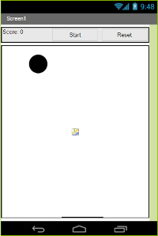

Els components Pelota i ImagenSprite tenen moltes característiques semblants. Ambdós poden respondre a esdeveniments del tipus "tocar" i són sensitius a les col.lisions amb altres components Pelota i ImagenSprite així com a col.lisions amb les cantonades del llenç. Per tant, són ideals per a crear un joc com el Pong.

La única diferència és que un ImagenSprite pot tenir una imatge associada, com és ara un rectangle negre, que representa la plataforma.

##PAS 3: Algunes consideracions sobre els components Lienzo, Pelota i SpriteImagen

Anem a veure ara algunes característiques importants del component "Lienzo" (llenç) i de com els components Pelota i ImageSprite hi interaccionen a dins. Mireu la imatge següent:

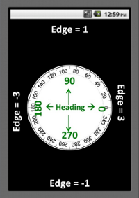

L'App Inventor dóna un número a cada un dels 4 costats (edges) del llenç tal i com es mostra a la imatge. Aquests números s'utilitzen per saber, per exemple, quan la pilota toca el terra: en aquest cas, "Borde" (Edge) serà igual a -1.

D'altra banda, els components Pelota i ImageSprite tenen una propietat anomenada "Dirección" (Heading) que ens permet saber cap a on es mouen:

* Dirección = 90 graus, vol dir que la pilota va cap amunt
* Dirección = 180 graus, vol dir que la pilota va cap a l'esquerra
* Dirección = 270 graus, vol dir que la pilota va cap avall
* Dirección = 0 graus, vol dir que la pilota va cap a la dreta

Més endavant veureu que per canviar de sentit la direcció de la pilota farem que Dirección canvii *360-Dirección graus*:

| Direcció  | Nova direcció  |
| :-------- | :------------- |
| 90        | 360-90=270     |
| 240       | 360-240=120    |

Això ho utilitzarem per exemple, per fer que la pilota, quan toqui la plataforma, boti en el sentit oposat que ho ha fet.

##PAS 4: Comença el joc. Fem que la pilota es mogui

La pilota es començarà a moure quan nosaltres premem el botó "ButtonStart". Un cop això pasi li donarem una direcció aleatòria a la pilota i farem que es mogui a certa velocitat.

Aneu a l'editor de blocs. Seleccioneu el component "ButtonStart" i arrossegueu el bloc:

```
cuando ButtonStart.Clic
ejecutar
```

A dins d'aquest bloc inicialitzarem les diferents propietats del component Ball1. Concretament hem de fixar la seva velocitat, la direcció, la posició i l'interval (interval en mil.lisegons en el qual s'actualitzarà la posició de la pilota). També perquè es mogui l'haurem d'habilitar. Seleccioneu el comoment Ball1 i arrossegueu a dins del bloc anterior els blocs següents tal i com mostra la imatge:

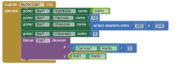

Segons el bloc anterior haureu fixat la direcció de la pilota a un valor aleatori comprès entre 225 i 315. Això farà que la pilota **es mogui cap avall** (recordeu que una direcció de 90 és cap amunt i una de 0 és cap a la dreta). Les propietats **Velocidad** i **Interval** ens diuen quan de depressa es mou la pilota. En aquest cas, la pilota es mou 5 píxels cada 10 mil.lisegons. Finalment, fixeu-vos com hem fet que la pilota es situï a la part superior-centrada del llenç.

##PAS 5: Fem que la pilota reboti en tocar una vora

En aquest joc, quan la pilota toqui una vora només la farem rebotar. Seleccioneu el component Ball1 i arrossegueu el bloc:

```
cuando Ball1.TocarBorde
borde
ejecutar
```

Ara li haurem de dir que quan toqui una vora reboti a la vora que ha tocat. Per fer-ho creeu els blocs de la imatge següent:


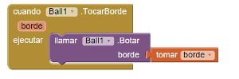

##PAS 6: Col.lisió amb la plataforma

De moment encara no hem programat el moviment de la plataforma que ens servirà per "collir" la pilota. El que farem ara és fer que la pilota reboti quan toqui la plataforma. El que farem és que reboti en el sentit contrari amb el qual hi ha arribat. Aquí farem servir l'expressió (360-Dirección) que havíem comentat abans. Seleccionem Ball1 i arrossegueu el bloc:

```
cuando Ball1.EnColisiónCon
otro
ejecutar
```

afegim-hi a dins els blocs següents:

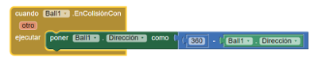

##PAS 7: Programem el moviment de la plataforma

Per controlar la plataforma l'usuari l'arrossegarà amb el dit per moure-la horitzontalment amb l'objectiu de "collir" la pilota. Per fer això utilitzarem el bloc de ImageSprite1:

```
cuando ImageSprite1.Arrastrado
XInicial YInicial XPrevio YPrevio XActual YActual
ejecutar
```
Com que la plataforma només es pot moure horitzontalment i no verticalment, la seva coordenada y serà sempre la mateixa (per exemple "ImageSprite1.Y"). No obstant, la coordenada x canviarà al valor "XActual". Així doncs ens caldrà crear els blocs següents:


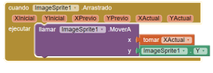


##PAS 8: Programem el botó de reset per tornar a començar el joc

El botó de reset el que farà serà col.locar altra vegada la pilota al centre de la pantalla. Seleccionem aquest component i creem els blocs següents:

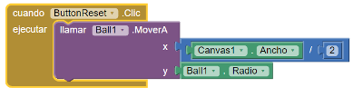


##Codi complet

Aquí teniu el codi de la versió bàsica del joc Pong.

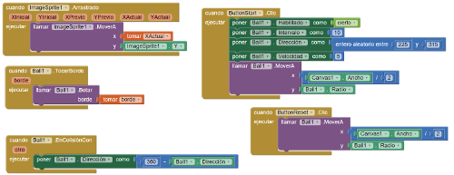

##Ampliacions

###1. Afegim un marcador

Per crear un marcador que funcioni seguiu els passos següents:

1. Creeu una variable global anomenada **puntuació** per guardar la puntuació del joc.

    

2. Feu que cada vegada que el jugador "culli" la pilota amb la plataforma (evitant així la seva col.lisió amb el terra) el marcador augmenti una unitat. Per fer-ho, haureu d'afegir aquest bloc en el bloc que es programa la col.lisió de la pilota i la plataforma.

    

3. Cada vegada que canvia el marcador, el nou valor s'ha de mostrar per pantalla. Per fer-ho, crearem un procediment anomenat **canviaIMostraPuntuacio**. Aquest procediment el cridarem quan cliquem el botó començar i cada vegada que la pilota col.lisioni la plataforma.
4. Arrossegueu el bloc següent:
```
como procedimiento
ejecutar
```

    i programeu-lo segons la imatge. Fixeu-vos que s'utilitza el bloc **unir** del calaix "Texto" per ajuntar els textos següents: "Puntuació:" i el valor d'aquesta puntuació.

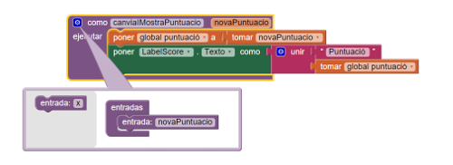

5. Els blocs que haureu de modificar són els següents:

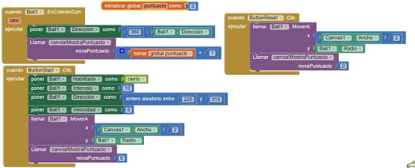

###2. Acabem el joc

El que farem ara és que quan la pilota toqui a terra (Borde=-1) el joc es pari. Programarem un bloc condicional que farà rebotar la pilota si no toca a terra i farà parar el joc si la pilota toca la part inferior de la pantalla. Llavors aturarem la pilota i farem aparèixer el missatge "Game Over!". Aquí sota podeu veure el blocs transformats:

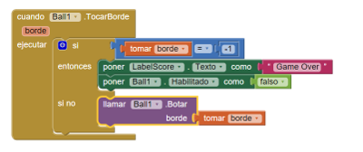

###3. Afegim efectes de so

La plantilla que us heu baixat conté fitxers de so que podeu utilitzar:

| Acció                                 | So          |
| :------------------------------------ | :---------- |
| La pilota toca el terra (game over)   | Buzzer.mp3  |
| La pilota toca una vora               | note.wav    |
| La pilota toca la plataforma          | Noink.mp3   |

Per utilitzar aquests sons us caldrà afegir un component "Medios/Sonido" des del panell de disseny. Llavors haureu d'anar a blocs i programar aquests sons.

###4. Més reptes
Aquí us deixem algunes idees perquè pugueu fer el vostre joc més divertit:

1. Proveu de fer un disseny més personalitzat dels objectes del joc. Per exemple, que la plataforma canvii de color aleatòriament o que la pilota tingui un color o un altre depenent de les vides que li queden. Canvieu color del llenç de la manera que us agradi més.
2. Afegiu un component "CasillaDeVerificación" per fer que l'usuari pugui activar o desactivar els sons del joc. Com els reprogramareu?
3. Modifiqueu la velocitat de la pilota amb la puntuació. Si el jugador falla molt, feu que vagi més lenta, si en canvi, el jugador va molt bé, incrementeu la velocitat de la pilota progressivament.
4. Afegiu una segona pilota al joc.
