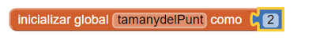

#Pot de Pintura

Aquest tutorial introdueix el concepte de llenç (canvas en anglès, lienzo en castellà) per crear gràfics de dues dimensions senzills. La guia original és en anglès i la podeu trobar [aquí](http://www.appinventor.org/apps2/paintpot2/paintpot2.pdf). Si us interessa també hi ha el [videotutorial](http://www.appinventor.org/content/CourseInABox/drawAnimate/PaintPot) (en anglès).

El que fareu és construir una app anomenada **PotdePintura** que permetrà a l'usuari tirar una foto i dibuixar-hi a sobre utilitzant diferents colors.

Aquest projecte us permetrà:

1. Utilitzar els vostres dits i pintar amb pintura virtual per dibuixar amb el color que triïs
2. Arrossegar el vostre dit per crear línies a la pantalla
3. Picar la pantalla per a fer punts
4. Netejar el dibuix prement un botó
5. Canviar la mida del punt amb un botó
6. Fer una foto amb la càmera i després dibuixar-hi a sobre

##Què aprendreu?

Aquest tutorial introdueix els conceptes següents:

1. Utilització del component "Lienzo" (llenç) per a dibuixar
2. Creació d'esdeveniments del tipus "tocar i arrossegar"
3. Control de la configuració de pantalla
4. Utilització d' "event handlers" amb arguments de configuració
5. Ús de variables per a emmagatzemar coses com el tamany del punt que hem triat per a dibuixar

##PAS 1: Comencem

Creeu un nou projecte a la web [d'App Inventor](http://appinventor.mit.edu/explore/). Anomeneu-lo "PotdePintura". Cliqueu a "Conectar" i connecteu-lo al vostre dispositiu mòbil com hem fet amb les pràctiques anteriors.

Aneu a la dreta del panell "Diseñador", a "Propiedades" i canvieu el títol de la pantalla posant-li **Pot de Pintura**. Si mireu la pantalla del vostre dispositiu mòbil, ara també ha d'aparèixer aquest nom. No confongueu el nom del projecte amb el nom de la pantalla:

* El nom del projecte serà també el nom de l'aplicació un cop estigui acabada. Aquest nom s'obté desplegant el menú "Proyectos", "Guardar proyecto como...".

* El nom de la pantalla, "Screen1", que veureu en el panell de "Componentes". Aquest nom inicial no es pot canviar.

* El títol de la pantalla, que és el que veieu a la barra superior de títol de l'app. Al principi té el mateix nom que el component de pantalla, "Screen1", però es pot canviar tal i com acabem de veure.

##PAS2: Disseny dels components

Per a fer aquesta app necessitareu crear els components següents:

* Tres **Botons** per a seleccionar els colors vermell, blau o verd i un component **"DisposiciónHorizontal"** per a organitzar-los

* Un altre component **Botó** per a netejar el dibuix i dos més per a canviar la mida dels punts quan dibuixem. També necessitareu un últim component botó per a fer una foto amb la càmera del mòbil.

* Un component **"Lienzo"** que serà la superfície sobre la qual dibuixareu. Aquest component té una propietat que li permet posar una image de fons. Per a començar utilitzareu [aquesta imatge](http://appinventor.mit.edu/explore/sites/all/files/tutorials/helloPurr/kitty.png) del gat, però més endavant modificareu l'app per tal de posar una imatge que preneu amb la càmera.

##PAS 3: Creem els components de color

Primer de tot, creeu 3 botons de color:

1. Arrossegueu un component "Botón" en el Visor, anomeneu-lo BotoVermell (els espais no són permesos en els noms de components).
2. Aneu a "propiedades", "texto" i poseu-hi "Vermell" i poseu-li també de fons el color vermell.
3. Feu el mateix creant dos botons més, un de blau i un de vermell.

Fixeu-vos que és important que canvieu el nom per defecte dels vostres components, en aquest cas, dels botons. Això fa que els projectes siguin més llegibles i quan els hagueu de programar els pugueu identificar més ràpid.

**Proveu la vostra app** connectant-la al vostre dispositiu mòbil.

##PAS 4: Arreglem la disposició dels botons

Ara el que veieu a la pantalla del vostre dispositiu mòbil són 3 botons enganxats i alineats a l'esquerra de la pantalla. El que volem és que tinguin una disposició horitzontal a dalt de tot de la pantalla. Ho farem utilitzant el component "Disposición Horizontal":

1. Arrossegueu el compomponent "Disposición Horizontal" sota dels botons.
2. En el panell de "Propiedades", canvieu "Ancho" i poseu-hi "Ajustar al contenedor" perquè agafi tot l'ample de pantalla.
3. Arrossegueu els 3 botons un a un dins el component "Disposición Horizontal".
4. Centreu la fila de botons anant a "Propiedades" er aquest element i posant "DispHorizontal" a "Centro".

| **Proveu la vostra app**                                                                       |
| :--------------------------------------------------------------------------------------------- |
| Connecteu-la al vostre dispositiu mòbil. Heu de veure els 3 botons centrats a la part superior |
| de la pantalla.                                                                                |

En general, es fan servir els components de disposició per a distribuir els elements per la pantalla d'una manera ordenada. També podeu provar de combinar-los per a obtenir disposicions més complexes.

##PAS 5: Afegim el llenç

El pas següent serà afegir el llenç sobre el qual dibuixarem:

1. Obriu "Paleta/Dibujo y animación" i arrossegueu el component "Lienzo" sobre del visor. Canvieu-li el nom a **LlençdeDibuix**. Feu que la seva amplada ("Ancho") sigui "Ajustar al contenedor" i d'aquesta manera ocuparà tot l'ample de pantalla. Feu que la seva alçada ("Alto") sigui de 300 píxels.
2. Baixeu-vos aquest [fitxer](http://appinventor.mit.edu/explore/sites/all/files/tutorials/helloPurr/kitty.png) a l'ordinador.
3. Feu que la imatge de fons del LlençdeDibuix sigui el fitxer *kitty.png* que us acabeu de baixar. Això ho trieu a "Propiedades/ImagenDeFondo".
4. Feu que "ColorDePintura" sigui vermell, per tal que si l'usuari encara no ha triat cap color comenci a pintar amb el color vermell.

##PAS 6: Afegim els botons de sota i el component per a la càmera

1. Des de "paleta" arrossegueu un segon component "DisposiciónHorizontal" i poseu-lo sota del llenç de dibuix. Després, arrossegueu dos components "Botón" a la pantalla i poseu-los a dins. Canvieu el nom del primer botó i poseu-li **BotoFerFoto**. A "Propiedades/Texto" canvieu-li el nom per a "Fer Foto". Canvieu el nom del segon botó a **BotoNeteja** i poseu-li de nom a "Propiedades/Texto" "Neteja".
2. Afegiu dos botons més dins del component "DisposiciónHorizontal", al costat del BotóNeteja.
3. Anomeneu-los **BotoGran** i **BotoPetit** respectivament, i feu que el seu text sigui "Punts grans" i "Punts petits".
4. Del panell de components "Medios" arrossegueu un component "Cámara" a la pantalla. Sortirà a la part no-visible del components.

##PAS 7: Programem els components, afegim un esdeveniment per dibuixar un punt

Ara toca definir què farà cada component. Pot semblar que crear un programa de dibuix sigui molt complicat, però App Inventor ja té molts blocs que us ajudaran.

En el panell "Diseñador", heu afegit un component anomenat "LlençdeDibuix". Ara farem que s'hi pugui dibuixar un punt al lloc on cliquem amb el dit:

1. Aneu a l'editor de blocs. Seleccioneu el "LlençdeDibuix". Arrossegueu el bloc **"cuando LlençdeDibuix.Tocar"** a la zona de treball. El bloc té paràmetres per les coordenades x i y del punt on hem tocat, així com "touchedAnySprite". Aquest segon paràmetre serveix per determinar si un objecte dibuixat en el Llenç s'ha tocat o no.

2. Amb el mateix component trieu un bloc **"Llamar LlençdeDibuix.DibujarCírculo"**. Per fer-ho, veureu que necessiteu 3 paràmetres: x, y i r. Les coordenades x i y ens diuen on hem de dibuixar el cercle i r determina el radi (o la mida) del cercle. El que li hem de dir aquí és que dibuixi el cercle just en el lloc on hem tocat la pantalla del nostre dispositiu. Per obtenir x i y, posarem el ratolí sobre la x o la y del bloc "cuando LlençdeDibuix.Tocar" i veurem que se'ns desplegaran dues opcions, "tomar x" o "poner x a". Triarem la primera.

3. Arrosseguem els blocs per les posicions de x i de y i enganxem-los al lloc corresponent del bloc "Llamar LlençdeDibuix.DibujarCírculo" tal i com es mostra la figura.

4. Ara haurem d'especificar el radi del cercle que dibuixarem. El radi es mesura en píxels. Per ara li donarem el valor 5: cliqueu en un lloc blanc de la pantalla, escriviu 5 i llavors apreteu la tecla retorn (això crearà un bloc amb el nombre automàticament). Seguidament enganxeu-lo en el lloc del radi. Fixeu-vos que després d'omplir el radi, a la part esquerra inferior de la pantalla, on posa "Mostrar avisos", sortirà el nombre 0, perquè ara tots els blocs estan completats.

| **Proveu la vostra app**                                                                       |
| :--------------------------------------------------------------------------------------------- |
| Quan toqueu el LlençdeDibuix amb el dit heu de veure que es dibuixa un punt al lloc on         |
| heu tocat. El punt ha de ser vermell perquè així ho hem triat al crear l'objecte LlençdeDibuix.|

##PAS 8: Afegim un esdeveniment per a dibuixar una línia

Ara afegirem un esdeveniment "Arrastrado" per a dibuixar una línia. La diferència entre tocar i arrossegar és la següent:

* Un esdeveniment *tocar* és quan poses un dit en el LlençdeDibuix i el treus sense moure'l.
* Un esdeveniment *arrossegar* és quan poses un dit en el LlençdeDibuix i el mous mantenint el contacte amb la pantalla.

En un programa de dibuix, si arrossegueu el vostre dit fent un arc per la pantalla, veureu que hi apareix una línia corba que segueix el camí del vostre dit. De fet el que esteu fent és dibuixar múltiples línies rectes molt petites que canvien la seva direcció cada vegada que moveu el dit.

Feu el següent:

1. Seleccioneu l'objecte LlençdeDibuix i arrossegueu al mig el bloc **"cuando llençdeDibuix.Arrastrado"**. Veureu que aquest bloc té els arguments següents:

    * "XInicial", "YInicial": posició del vostre dit quan comenceu a arrossegar.
    * "XActual", "YActual": la posició del vostre dit en aquest moment.
    * "XPrevio", "YPrevio": la posició immediatament anterior del vostre dit.
    * "draggedAnySprite": aquest és un valor Booleà (cert/fals) que serà cert si l'usuari arrossega el dit directament sobre una imatge dibuixada. No utilitzarem aquest argument en aquest tutorial.
2. Arrossegueu ara el bloc **llamar LlençdeDibuix.DibujaLínea** a dins del bloc anterior tal i com mostra la figura. Aquest bloc té 4 arguments, dues coordenades x, y per a l'inici de la línia i dues coordenades x, y per al final de la línia. Recordeu que l'esdeveniment "llençdeDibuix.Arrastrado" es cridarà moltes vegades mentre estigueu arrossegant el vostre dit per el LlençdeDibuix. L'app dibuixarà una línia petita cada vegada que el vostre dit es mogui, des de (XPrevio, YPrevio) fins a (XActual, YActual).

3. Arrossegueu ara els blocs per als arguments tal i com es mostra a la figura. Per fer-ho us caldrà posar el ratolí sobre "XPrevio" i els altres arguments del bloc "cuando llençdeDibuix.Arrastrado" i triar "tomar XPrevio" per exemple.

| **Proveu la vostra app**                                                                       |
| :--------------------------------------------------------------------------------------------- |
| Proveu què passa quan arrossegueu el vostre dit per la pantalla per a dibuixar línies i corbes.|         | Proveu també de tocar la pantalla amb el dit per a dibuixar punts.                             |

##PAS 9: Canviar el color

L'app que heu construït us deixa dibuixar però només utilitzant el color vermell. Ara haurem de programar els botons dels colors i també el botó per a netejar la pantalla. Aneu a l'editor de blocs i:

1. Seleccioneu l'objecte "BotoVermell" i arrossegueu a la zona de treball el bloc **cuando BotoVermell.Clic ejecutar**.
2. Seleccioneu l'objecte LlençdeDibuix i arrossegueu el bloc **poner LlençdeDibuix.ColorDePintura como** al mig del bloc anterior.
3. Obriu el calaix de "Integrados/Colores" i arrossegueu en el bloc el color vermell. Enganxeu-lo al bloc LlençdeDibuix.ColorDePintura.
4. Repetiu els passos anteriors per els botons blau i verd.
5. Ara només ens queda programar el BotoNeteja. Seleccioneu-lo i arrossegueu a la zona de treball el bloc **cuando BotoNeteja.Clic ejecutar**. Seleccioneu l'objecte LlençdeDibuix i trieu el bloc **llamar LlençdeDibuix.Limpiar**.

| **Proveu la vostra app**                                                                       |
| :--------------------------------------------------------------------------------------------- |
| Proveu de canviar de color clicant els botons. Dibuixeu línies i punts de diferent color.      |
| Proveu després de clicar el botó Neteja a veure si es neteja la pantalla.                      |

##PAS 10: Fer que els usuaris puguin tirar una foto

Per fer-ho més divertit permeteu que els usuaris triin el fons de dibuix tirant una foto amb la càmera. L'objecte Camera té dos blocs clau. El bloc **Cámara1.TomarFoto** crida la càmara del dispositiu. El bloc **cuando Cámara1.DespuésDeTomarFoto** es crida després que l'usuari hagi tirat la foto. Utilitzarem aquest bloc per a canviar la imatge de fons de l'objecte LlençdeDibuix.

1. Seleccioneu l'objecte BotoFerFoto i arrossegueu a la zona de treball el bloc **cuando BotoFerFoto.Clic ejecutar**.
2. Seleccioneu l'objecte Cámara1 i arrossegueu el bloc **llamar Cámara1.TomarFoto** i poseu-lo dins del bloc anterior.
3. Arrossegueu a la zona de treball el bloc **cuando Cámara1.DespuésDeTomarFoto**.
4. Seleccioneu l'objecte LlençdeDibuix i arrossegueu el bloc **poner LlençdeDibuix.ImagenDeFondo como** dins del bloc anterior. El bloc **Cámara1.DespuésDeTomarFoto**  té un argument "imagen". Poseu-hi el ratolí a sobre i trieu "tomar imagen". Enganxeu aquest bloc després de **poner LlençdeDibuix.ImagenDeFondo como** tal i com es mostra a la figura.

| **Proveu la vostra app**                                                                       |
| :--------------------------------------------------------------------------------------------- |
| Cliqueu el botó Fer Foto des del vostre dispositiu i tireu una foto. La imatge del gat ha de   |
| canviar a la foto que acabeu de tirar. Ara heu de poder dibuixar sobre aquest foto.            |    

##PAS 11: Canviar la mida del punt

En el **PAS 7** hem posat el tamany del punt a 5 píxels. Per a canviar el tamany li hem de donar un valor diferent al radi. Canvieu la mida de r de 5 a 10 i proveu-ho amb el vostre dispositiu a veure com queda.

Fins ara el tamany del punt ve determinat pel que nosaltres li hàgim dit a l'aplicació. Però ens agradaria que l'usuari pugui triar el tamany d'aquest punt. El que farem és utilitzar els botons BotoGran i BotoPetit per aquesta funció.

Utilitzarem una **variable** per a guardar el tamany del punt. Una variable és un lloc en lal memòria on s'hi guarden dades que poden variar. En aquest cas s'hi guarda la mida del punt que volem dibuixar.

Comencem per a definir una variable que s'anomeni **tamanydelPunt**:

1. En l'editor de blocs, seleccioneu el calaix "Variables" i arrossegueu el bloc **inicializar global nombre como**. Canvieu el valor "nombre" a "tamanydelPunt". Això ens crea una variable anomenada tamanydelPunt.
2. Ens falta definir quin serà el valor inicial de la variable tamanydelPunt. Escrivim 2 en un lloc buit de la pantalla, premem la tecla retorn i arrosseguem el bloc 2 a continuació del bloc anterior.

##PAS 12: Utilitzar el valor de la variable a l'hora de dibuixar el punt

Ara el que volem és canviar l'argument del bloc **llamar LlençdeDibuix.DibujarCírculo** dins del bloc **cuando LlençdeDibuix.Tocar** per tal que utilitzi el valor emmagatzemat a la variable tamanydelPunt (en aquest moment us semblarà que jhem fixat el valor del tamanydelPunt a 2, però ja veureu més endavant com canviarem aquest valor segons decideixi l'usuari).

1. Aneu al calaix de blocs "Integrados/Variables" i arrossegueu el bloc **tomar**. Desplegueu l'argument i trieu la variable global tamanydelPunt.
2. Aneu al bloc LlençdeDibuix.DibujarCírculo, a l'apartat del radi, llenceu el nombre 5 a la paperera i reemplaceu-lo per el bloc que heu creat en l'apartat anterior.

##PAS 13: Canvieu el valor de tamanydelPunt

Ara hem de permetre que l'usuari pugui determinar el tamany del punt. Per això ens caldrà programar els objectes BotoGran i BotoPetit:

1. Seleccioneu l'objecte BotoPetit i arrossegueu el bloc **cuando BotoPetit.clic ejecutar** a la zona de treball.
2. Aneu ara al bloc **inicializar global tamanydelPunt como** i poseu el ratolí sobre tamany del punt. Arrossegueu el bloc **poner global tamanydelPunt a** dins de **cuando BotoPetit.clic ejecutar**. Finalment creeu un bloc número 2 i enganxeu-lo aquí.
3. Creeu un bloc similar per a l'objecte BotoGran però feu que el tamany del cercle sigui 8 enlloc de 2.

| **Proveu la vostra app**                                                                                 |
| :------------------------------------------------------------------------------------------------------- |
| Proveu què passa quan cliqueu els botons de tamany i dibuixeu punts sobre la pantalla. Tenen tamanys     |
| diferents? Aquests botons no afecten el tamany de la línia quan la dibuixeu, però podríeu pensar quelcom |
| similar i fer-ho (pista: llençdeDibuix té una propietat "AnchoDeLínea").                                 |

##Blocs complets per a l'app Pot de Pintura

##Variacions

Aquí us deixem algunes variacions que podeu explorar:

* L'app no dóna a l'usuari cap informació de les opcions de dibuix. La única manera de saber com és el tamany del punt que es dibuixa és dibuixant-lo. Modifiqueu l'app per tal que aquests valors siguin visibles a l'usuari.
* Deixeu que l'usuari especifiqui altres valors diferents a 2 i 8 per el tamany del punt utilitzant un component "Deslizador" de la "Interfície de usuario".

##Resum

Aquí resumim els aspectes que s'han treballat en aquesta pràctica:

* El component "Lienzo" us permet dibuixar. Això fa que si toquem la pantalla o hi arrosseguem el dit puguem programar funcions de dibuix.
* Es poden utilitzar components de "Disposición" per a organitzar els elements a la pantalla en comptes de posar-los un a sota de l'altre.
* Alguns blocs dels objectes inclouen informació sobre l'esdeveniment, com és ara les coordenades del punt on s'ha tocat a la pantalla. Aquesta informació és representada per *arguments*. Quan s'utilitzen arguments, App Inventor crea les funcions *tomar* i *poner* per utilitzar i referenciar aquests arguments.
* Podeu crear *variables* utilitzant el bloc *inicializar global nombre* del calaix de Variables. Les variables ens permeten recordar informació com el tamany del punt.
* Per a cada variable que definiu, l'App Inventor automàticament crea un bloc *tomar global nombre* que retorna el valor de la variable, i *poner global nombre* que permet canviar el valor de la variable. Per accedir-hi, només cal posar el ratolí sobre el nom de la variable en el seu bloc d'inicialització.
