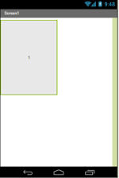
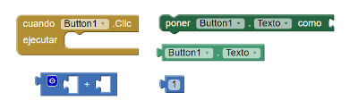
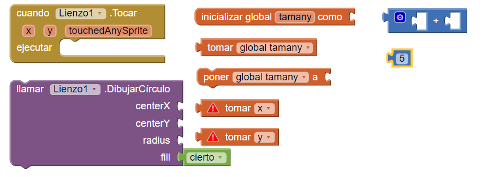
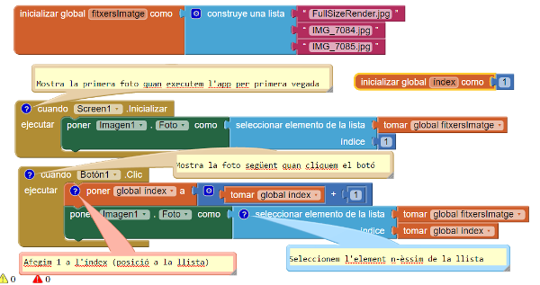

#Presentació de diapositives

Amb aquesta pràctica aprendrem un de les coses més importants a l'hora de fer un programa, que és iterar a través dels elements d'una llista, utilitzant l'índex de cada element per a trobar-ne un de concret. Això ja ho vam treballar una miqueta anteriorment, però aquí ho veurem amb més detalls.
Al final d'aquesta pràctica construireu una presentació de diapositives (fotos) que us permeti anar endavant, endarrera o fins i tot escollir un element concret.

Aquesta pràctica és una versió adaptada de les 3 primeres pràctiques que trobareu [aquí](http://www.appinventor.org/content/CourseInABox/quizApps).

##Què aprendreu?

Aquesta app cobreix els conceptes següents:

1. L'increment de valors i variables com a preparació prèvia per a treballar amb els índexs quan ens movem dins d'una llista.
2. La creacció d'una app per fer una presentació de diapositives. Aquesta app pot ser utilitzada per a construir una app estil *qüestionari*, una app per a trobar els vostres companys de classe, de fet, per a construir qualsevol app que navegui a través d'una informació temàtica concreta.
3. El mecanisme per a iterar en una llista d'informació amb un índex variable

##PAS 1: Escalfament

Abans de començar a crear l'app seriosament farem uns *exercicis d'escalfament* per aprendre a incrementar i disminuir un determinat valor guardat en una variable.

1. **Incrementar valors**. Configureu els blocs següents de tal manera que s'afegeix un 1 al nombre cada vegada que cliqueu el botó. A sota teniu la imatge de la pantalla i els blocs que necessitareu.

    
    

2. **Variables**:
    * Què vol dir la paraula *variable* des del punt de vista de la programació?
    * Sabeu quina és la diferència entre *variable* i *propietat d'un component* en App inventor?
    * Què és el que defineix una variable?
    * Creeu una nova app i afegiu-hi només un component, **Lienzo**. Configureu els blocs següents per tal que cada vegada que l'usuari toqui el llenç, es dibuixi un cercle 5 píxels més grans que el cercle anterior. És possible que hagueu d'utilitzar els blocs més d'una vegada.

    

##PAS 2: Iteració a través d'una llista amb informació

A sota us donem una llista de blocs per a fer una app que consisteix en un botó que cada cop que es clica a la pantalla hi apareix una nova foto. Per fer-la necessitareu:

1. Pujar a l'app inventor com a mínim 3 fotos de llocs o gent que us agradin.
2. Un component **imagen**
3. Un component **botón**

Tota manera no us ho posem del tot fàcil perquè els blocs de la imatge tenen alguna errada (*bug* en la terminologia dels programadors). Les sabeu trobar?

##PAS 3: Intenta descriure què fa la app utilitzant llapis i paper

Agafa un paper i intenta descobrir què fa la app cada vegada que cliquem el botó. Escriu per a cada foto el valor de la variable global **índex** i el nom del fitxer que representa.

##PAS 4: Arregleu la app

Arregleu la app perquè **torni a la primera imatge** un cop hagi arribat al final (pista: necessitareu un bloc **si**). Intenteu fer-ho pel vostre compte. Si us encalleu, sempre podeu llegir [aquesta ajuda (en anglès)](http://www.appinventor.org/content/howDoYou/ListNav/next).

##PAS 5: Millorem la app

1. Afegiu noves fotos a la presentació de diapositives (com a mínim n'hi ha d'haver 10)
2. Feu que la presentació de diapositives s'aturi quan s'arribi a l'última foto (fent per exemple que el botó *següent* es desactivi i es posi gris)
3. Afegiu un botó **Anterior** perquè l'usuari pugui anar enrera i veure la foto prèvia a la que s'està mostrant. Feu que aquest botó es desactivi, igual com hem fet en el punt anterior, quan s'arribi a la primera fotografia.
4. Afegiu un botó **Començar presentació** quan quan es cliqui s'engegui una presentació automàtica que canvii la foto automàticament cada 5 segons.

##PAS 6: Creeu una app "Coneix els meus companys de classe"

1. Creeu una nova còpia del projecte anterior i anomeneu-la "companys_de_classe"
2. Feu fotos als vostres companys de classe, pugeu-les a la secció **Media** de la vostra app.
3. Creeu una **etiqueta** per mostrar el nom de la persona que surt a la foto i una **variable global LlistadeNoms** que conté la llista dels noms dels vostres companys que apareixen a les fotos.
4. Programeu la vostra app de tal manera que cada vegada que surti una nova fotografia, a sota, l'etiqueta mostri el nom de la persona

##PAS 7: Repte, converteix la app en un joc

Pensa com convertir la app en un joc que ens ajudi a aprendre el nom dels companys de classe. Com ho faries? Pensant-ho bé, seria de molta utilitat per a alguns professors! ;-)
