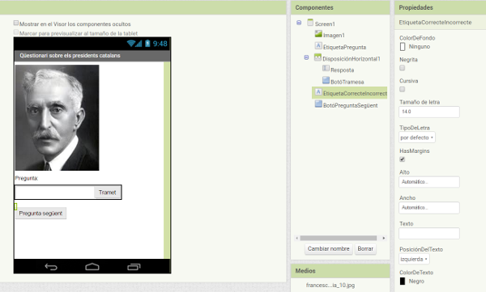
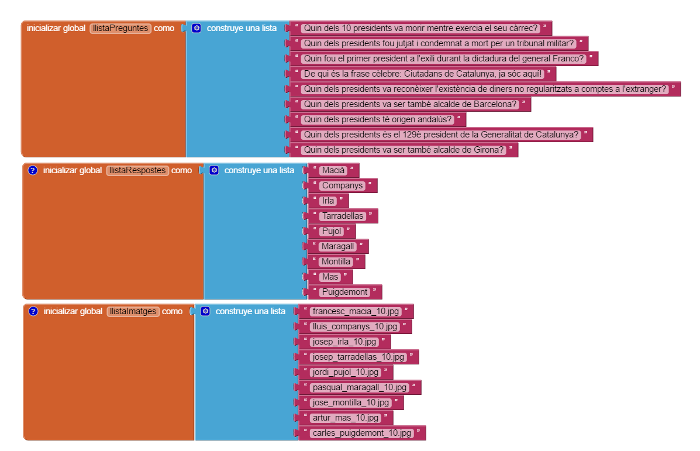
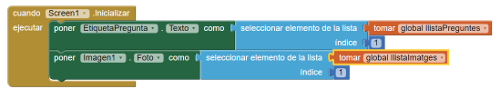
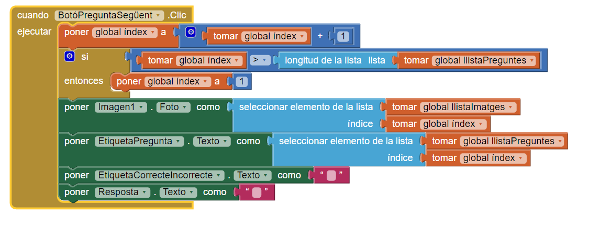

#Fem un qüestionari tipus trivial?

Amb aquesta pràctica aprendrem a fer un joc tipus trivial sobre [els presidents de Catalunya de l'últim segle](http://www.president.cat/pres_gov/president/ca/presidencia/galeria-presidents/index.html). De fet aquest serà el començament de la pràctica, perquè al final haureu de triar vosaltres sobre què voleu fer el qüestionari.

En les pràctiques anteriors heu après alguns conceptes fonamentals de programació. Ara esteu apunt per fer quelcom una mica més complicat. Veureu que aquí es requereix un salt conceptual en termes d'habilitats de programació i de pensament abstracte. En particular, fareu servir dues llistes de variables per a emmagatzemar dades -en aquest cas les llistes de preguntes i respostes del qüestionari- i utilitzareu una vriable índex per a saber a quin lloc de les dues llistes us trobeu. Quan hàgiu acabat, tindreu els coneixements suficients per crear apps amb qüestionaris i qualsevol altra app que treballi amb llistes.

Per a fer aquesta pràctica heu de tenir clars els conceptes bàsics de l'App inventor: saber dissenyar els components de la pestanya *Diseñador* i utilitzar l'editor de blocs per a programar-los. Si no esteu familiaritzats amb aquests dos aspectes bàsics, millor que reviseu les pràctiques anteriors.

Més concretament, el que fareu serà dissenyar un qüestionari en el qual l'usuari va de pregunta en pregunta clicant un botó *pregunta següent* i després rep *feedback* sobre si la resposta és correcta o no.

Aquesta pràctica és una versió adaptada de la pràctica que trobareu [aquí](http://www.appinventor.org/content/CourseInABox/quizApps/PresidentsQuiz).

##Què aprendreu?

Aquesta app cobreix els conceptes següents:

1. La definició de variables com a llistes per a emmagatzemar les preguntes i les respostes d'un qüestionari.
2. La seqüenciació a través d'una llista utilitzant un índex. Cada cop que es premi el botó *pregunta següent* apareixerà una nova pregunta.
3. La utilització d'instruccions condicionals, per exemple quan l'usuari arriba a la última pregunta.
4. El canvi d'imatges per a mostrar imatges diferents per a cada pregunta del qüestionari.

##PAS 1: Comencem

Connecteu-vos a la web de l'App Inventor i comenceu un nou projecte. Anomeneu-lo *questionari_presidents* i poseu com a títol a la pantalla *Qüestionari sobre els presidents catalans*. Obriu l'editor de blocs i connecteu-vos al telèfon. Necessitareu també baixar-vos el [fitxer comprimit](https://github.com/mdosil/AppInventor/tree/master/img/presidents_10.zip) amb les imatges dels presidents. Necessitareu les imatges més tard.

##PAS 2: Disseny dels components

El qüestionari té una interfície molt simple on es mostrarà la pregunta i hi haurà un espai perquè l'usuari la pugui respondre. Podeu construir els elements seguint la captura de pantalla que veieu a continuació.
Recordeu també de descomprimir el fitxer que us heu baixat amb les imatges i pujar-lo a l'apartat de *medios*.

Les propietats que haureu d'assignar a cada component són les següents:

1. Poseu com a primera imatge el fitxer *francesc_macia_10.jpg*. D'amplada poseu-hi *ajustar al contenedor* i d'alçada 200 píxels.
2. Per l'etiqueta **EtiquetaPregunta** poseu-hi el text *Pregunta*, ja hi escriurem la primera pregunta en l'editor de blocs.
3. Pel quadre de text **Resposta** poseu-hi, a la propietat **Pista** *Entreu aquí la vostra resposta*.
4. Escriviu *Tramet* al text del botó **BotóTramesa**.
5. Escriviu *Pregunta següent* al text del botó **BotóPreguntaSegüent**.
6. Poseu un text buit a l'etiqueta **EtiquetaCorrecteIncorrecte**.

##PAS 3: Programem els components

Aquesta app funciona com un qüestionari interactiu. L'usuari contesta una sèrie de preguntes sobre els presidnets catalans. Amb cada pregunta l'app diu si la resposta de l'usuari és correcta o incorrecta. L'usuari pot passar a la pregunta següent clicant el botó **BotóPreguntaSegüent**, i així sortirà una nova foto i una nova pregunta. Les preguntes, les respostes correctes i les imatges es troben guardades en llistes diferents. Es farà servir un **índex** per assegurar-nos que una pregunta en concret s'aparelli amb la seva resposta correcta i la seva imatge.

###Creem les llistes llistaPreguntes, llistaRespostes i llistaImatges

Anem a crear 3 llistes arrossegant els blocs corresponents tal i com mostra la imatge de sota. Haureu d'introduir el text de les preguntes i les respostes manualment.

Fixeu-vos que la primera pregunta en la **llistaPreguntes** va amb la primera resposta en **llistaRespostes** i va amb la primera imatge de la llista **llistaImatges**. Aquest és un exemple del que se'n diu *llistes paral.leles*. Això ens permetrà jugar amb les preguntes, respostes i imatges d'una manera més cómode utilitzant un **índex**.

###Inicialitzem l'aplicació

Per inicialitzar l'aplicació caldrà cridar el component **cuando Screen1.Inicializar ejecutar**. Farem el següent:

1. Posarem que la primera pregunta que es mostri a l'etiqueta **EtiquetaPregunta** sigui la primera pregunta de la **llistaPreguntes**.
2. A **Imagen1** hi posarem la primera imatge de la llista **llistaImatges**
3. Fem que l'etiqueta **EtiquetaCorrecteIncorrecte** no hi posi res.

Heu d'obtenir doncs els blocs següents:

###Inicialitzem una variable índex

La indexació de les llsites és una part molt important de la programació. Si es fa ben fet ajuda als programadors a referenciar els ítems d'una llista de manera fàcil. Creem una variable índex que ens servirà per localitzar el nombre de pregunta amb el qual estem treballant. De moment li donem el número 1.

###Programem el botó Pregunta següent

El codi que hem escrit fins ara només funciona per a la primera pregunta del qüestionari. Anem a programmar l'app perquè les altrse 3 preguntes apareguin quan cliquem el **botóPreguntaSegüent**.  Quan l'usuari cliqui el botó ha de passar el següent:

1. L'**índex** s'ha de moure a la pregunta següent. Això significa la posició següent en la **llistaPreguntes**, excepte quan l'usuari es troba ja al final de la llista. Llavors, si això passa, quan es premi *Pregunta següent* s'haurà de tornar a mostrar la primera pregunta. En aquesta app, el final s'aconsegueix quan l'índex arriba a 9 perquè només hi ha 9 preguntes.
2. L'etiqueta **EtiquetaPregunta** ha de msotrar el text de la pregunta amb l'índex correcte a la **llistaPreguntes**.
3. La imatge que s'ha de mostrar ha de correspondre amb la de l'índex correcte de la **llistaImatges**.
4. L'**EtiquetaCorrecteIncorrecte** i la finestra de text **Resposta** no han de contenir el text de la pregunta anterior sinó que no han de mostrar cap text.

El codi que necessiteu el teniu a sota:

###Comprovem la resposta de l'usuari

L'usuari entrarà les respostes en el quadre de text **Resposta** i clicarà el botó **BotóTramesa**. Per a comprovar la pregunta necessitarem un bloc condicional:

1. Arrossegueu un bloc *si* i modifiqueu-lo perquè digui *si/si no*.
2. Penseu com ho fareu per a comprovar que la resposta a la pregunta és correcta. Haurem de comparar si els 2 textos (el que hi ha emmagatzemat a la llista **llistaRespostes** i el que entra l'usuari en la finestra de text **Resposta**) són iguals. En cas afirmatiu, la resposta és correcta, en cas negatiu, incorrecta.
3. Mostrarem a l'etiqueta **EtiquetaCorrecteIncorrecte** *correcte!* o *incorrecte!* segons sigui el cas.

Aquí no us mostrem els blocs. Haureu de crear una instrucció **cuando BotóTramesa.Clic** i pensar com serà el bloc condicional que hi posareu a dins.

**Proveu la vostra app**

Connecteu la vostra app a l'AI Companion i jugueu-hi una mica. Funciona?

##PAS 4: Milloreu la vostra app

Aquest qüestionari és molt senzill i es pot millorar de moltes maneres. Anem a fer-ho ara creant un altre projecte. Penseu un qüestionari de 10 preguntes sobre algun tema que us agradi. Guardeu el projecte anterior amb aquest nom i intentareu modificar-lo per a crear un qüestionari nou, ara millorat:

1. Introduïu 10 noves preguntes, 10 noves respostes i 10 noves imatges
2. El qüestionari anterior és molt rígid pel que fa a la resposta. Si no s'entra el text exacte et marca la resposta com a incorrecta. Hi ha moltes maneres de modificar això, una manera és utilitzar el bloc **contiene texto cadena**, per a veure si el que ha introduït l'usuari està dins el text de la resposta correcta. També podríeu pensar com ho faríeu per gestionar els caràcters espai que l'usuari introdueix a la resposta o per a acceptar com a correcta una resposta escrita en mínúscula quan el programa hi té escrita una resposta en majúscula, per exemple.
3. Una altra modificació possible seria que les preguntes no sempre apareixessin en el mateix ordre. Per fer-ho, hauríeu de generar un enter aleatori que servís d'índex de pregunta/resposta/imatge. Llavors en clicar el botó *Pregunta següent* es generaria un altre enter com a índex.
4. També podeu intentar transformar el qüestionari en un de tipus *multiple choice*, amb 4 respostes possibles per a cada pregunta. Per a fer això necessiteu una llista addicional que contingui les 4 respostes per a cada pregunta. Les respostes possibles seran una llista de llistes, on cada subllista contingui les obcions de resposta per a una pregunta en particular. En aquest cas haureu d'utilitzar el component **Selector de lista** perquè l'usuari pugui triar una resposta. Podeu trobar més informació de com fer això [aquí](http://www.appinventor.org/bookChapters/chapter19.pdf) (en anglès).
5. Afegiu un comptador de preguntes encertades/fallades.

##Resum

En aquesta pràctica hem cobert els aspectes següents:

* La separació els diferents tipus de dades que intervenen en una app en llistes diferents.
* L'ús dels blocs **si si no** per a comprovar condicions.
* La referència de *manera abstracta* als elements d'una llista i al tamany de la llista, mitjançant la utilització d'índexs. Això es fa així perquè el programa funcioni encara que les dades en una llista canviin canviant-ne el seu tamany.
* Els índexs a les llistes com a forma de localitzar un element i la seva gestió quan arribem al final d'una llista.
