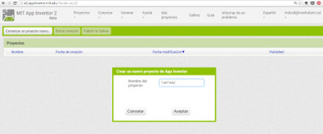

#Talk to me: la teva primera App


*Aquesta guia pas a pas t'ajudarà a fer la teva primera App amb [AppInventor](http://appinventor.mit.edu/). La guia original és en anglès i la podeu trobar [aquí](http://appinventor.mit.edu/explore/sites/all/files/hourofcode/TalkToMePart1.pdf).*


##PAS 0: Aneu a la pagìna d'inici d'App Inventor [www.appinventor.mit.edu](http://appinventor.mit.edu/).

Cliqueu el botó taronja "Create Apps" a la barra de menús:


##PAS 1: Connecteu-vos a App Inventor amb un usuari i contrasenya google

De fet, el vostre usuari i contrasenya @insvilafant.cat us serveix:


Trieu un compte Google si en teniu més d'un. Cliqueu després a "Allow":


##PAS 2: Llegiu els anuncis d'App Inventor i cliqueu a "Continue"


Si no teniu cap projecte creat a l'App Inventor, aterrareu a la pàgina "My Projects":


En aquesta pàgina també podreu canviar l'idioma a "Español" si ho desitgeu.


##PAS 3: Creeu un nou projecte

Cliqueu el botó "Empezar nuevo proyecto". Si ja en teniu de creats, l'App Inventor us obrirà el projecte més recent. Anomeneu el projecte "TalkToMe" (sense espais) i cliqueu OK.



##PAS 4: L'App Inventor obre la pestanya de disseny

La pestanya de disseny és des d'on creeu la Interfície Gràfica d'Usuari (GUI) o com es veurà la vostra app. Podeu triar components com botons, imatges i finestres de text i funcionalitats com text-a-parla, sensors i GPS.


##PAS 5: Afegiu un botó

Cliqueu la paraula "Botón" a la paleta. Arrossegueu el ratolí sobre el visor. Deixeu anar el ratolí. Us apareixerà un nou botó en el visor.


##PAS 6: Baixeu-vos el MIT AI2 Companion App

Aneu al Google Play Store i baixeu-vos el MIT AI2 Companion App. El podeu instal.lar en un mòbil o una tauleta que tingui sistema operatiu Android. Si ho baixeu directament del Google Play Store va millor perquè se us actualitzarà automàticament.


Si el vostre mòbil té una app per llegir codis QR, podeu escanejar la imatge de sota. Us portarà a la AI2 Companion app al Google Play store des d'on ho podreu clicar i instal.lar. Llavors trobareu l'app a la carpeta de Baixades del vostre dispositiu.


Si no teniu un mòbil o tauleta Android, encara podeu utilitzar l'App Inventor connectant-lo amb un emulador. Aneu a l'enllaç [http://appinventor.mit.edu/explore/ai2/setup.html](http://appinventor.mit.edu/explore/ai2/setup.html) i seguiu les instruccions des d'on diu "Option 2" (en anglès).


##PAS 7: Connecteu el vostre dispositiu al projecte App Inventor

Mentre construïu una app amb l'ordinador, la podeu provar en una tauleta o mòbil Android. Assegureu-vos que **tant l'ordinador com el vostre dispositiu mòbil estan connectats a la mateixa xarxa WIFI**.

Aneu a la finestra de disseny del vostre projecte i desplegueu el menú "conectar". Trieu l'opció "AI Companion" (o Emulador, en cas de no tenir dispositiu Android). A la pantalla de l'ordinador us sortirà un codi QR i un codi de text amb 6 caràcters:


Obriu l'AI Companion app en el vostre dispositiu mòbil. Us sortirà una pantalla amb la opció d'escanejar el codi QR o entrar la el codi de 6 caràcters.

Si trieu d'escanejar el codi, premeu el botó blau "scan QR code". Escanegeu-lo. Espereu pocs segons i s'obrirà la vostra app en el mòbil.

Si trieu utilitzar el codi, inserteu-lo en la finestra de text i cliqueu després el botó taronja.


##PAS 8: Veure la vostra app en el dispositiu connectat

Sabreu que la vostra connexió és correcta quan veieu la vostra app a la pantalla del vostre dispositiu mòbil. Com que la vostra app només té un botó, això és el que veureu. A mida que afegiu més components al projecte, l'app s'actualitzarà en l'ordinador i en el mòbil.


##PAS 9: Canvieu el text del botó

Al panell de "Propiedades", canvieu el text del botó. A la capseta "Texto para Botón1", esborreu-ho i poseu-hi "Talk to me". Veureu que de seguida el text de la vostra app en el dispositiu mòbil  també ha canviat de nom.


##PAS 10: Afegiu el component "Texto a Voz"

Aneu a l'apartat "Medios" de la paleta, i arrossegueu un component "Texto a Voz" en el visor. Fixeu-vos que apareix sota la pantalla, a "Componentes no visibles". Això passa perquè no és quelcom que es mostrarà a la interfície d'usuari de la app.


##PAS 11: Canvieu la vista a la pestanya "Bloques"

Ara li heu de dir a la vostra app què voleu que faci. L'editor "Bloques" és des d'on programareu la vostra app. Sovint canviareu entre la pestanya "Bloques" i la pestanya "Diseñador".


Si us fixeu en aquest panell hi ha blocs que tenen operacions matemàtiques, lògiques i text. A sota també hi ha blocs que van amb cada un dels components de la vostra app, per això, si voleu veure els blocs que van amb components específics, com és ara un botó, cal que primer l'afegiu a la pestanya "Diseñador".

##PAS 12: Crear un esdeveniment clicar un botó

Cliqueu en l'objecte "Botón1". Us apareixeran una sèrie de blocs de codi possibles. Cliqueu ara i arrossegueu el bloc:

 ```cuando Botón1.click
 ejecutar
 ```
 Arrossegueu-lo sobre el visor i deixeu-lo anar. Aquest bloc s'executarà quan cliqueu el botó de la vostra app. Això s'anomena "Event Handler".


##PAS 13: Programeu l'acció "Texto a Voz"

Cliqueu l'objecte "Texto a voz". Cliqueu i arrossegeu el bloc:

```
llamar TextoAVoz.Hablar
mensaje
```


Arrossegueu-lo sobre el visor i deixeu-lo anar allà. Aquest és el bloc que farà que el telèfon parli. Com que el deixem anar dins del "Botón1.click", s'executarà quan el botó de la vostra app es cliqui.


##PAS 14: Escriviu un missatge

Desplegueu "Texto" i trieu el primer bloc. Arrossegueu-lo dins del bloc anterior. Escriviu-hi a dins un missatge:


##PAS 15: Proveu la vostra primera app!

Aneu al vostre dispositiu mòbil i cliqueu el botó. Assegureu-vos que teniu el volum apujat. Haureu de sentir com el telèfon diu la frase que li heu introduït quan cliqueu el botó.

##Repte: TalkToMe part 2

Podeu millorar la vostra app fent que el dispositiu mòbil parli quan el sacsegeu i deixant que els usuaris siguin els que entrin el seu propi text.
