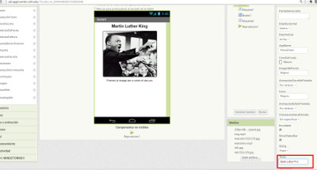
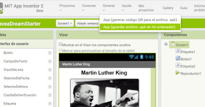
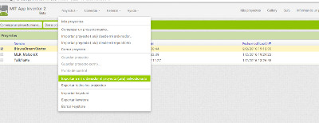

#Publiqueu la vostra app

Amb aquest tutorial aprendreu a publicar una app. La guia original és en anglès i la podeu trobar [aquí](http://www.appinventor.org/content/CourseInABox/Intro/PublishingHowTo).

##PAS 1: Creeu un portfoli web

Podeu crear un portfoli web fent servir [Google Sites](http://sites.google.com). Aquest portfoli servirà per a guardar-hi totes les apps que aneu creant.

##PAS 2: Doneu a la vostra app un nom descriptiu, un títol i una icona

Seleccioneu l'app que vulgueu publicar. Doneu-li un nom descriptiu (per exemple, no li dieu "Projecte 1"). Aquest nom apareixerà en el telèfon quan hi instal.lem l'app. Aquest nom es pot canviar si des de l'App Inventor, amb el vostre projecte obert, feu "guardar como".

Aneu al panell de disseny i doneu-li un nom descriptiu a la vostra pantalla (en general, sol ser el mateix nom del projecte). Això ho trobareu a "Propiedades", en el panell dret, a baix de tot, a la caixeta on posa "Título".

##PAS 3: Doneu una icona a la vostra app

La icona és la imatge que surt en el mòbil un cop està instal.lada l'app. Per a donar una icona a l'app només heu de carregar una imatge a "Propiedades", a la caixeta on posa "icono".

##PAS 4: Baixeu la vostra app APK i el codi font

Baixeu la vostra app a l'ordinador. L'app és un fitxer amb extensió **.apk**. Per generar-la, trieu del menú superior "Generar App (guardar archivo .apk en mi ordenador)".

Per baixar-vos el codi font (blocs) de la vostra app a l'ordinador heu d'anar a la pàgina dels vostres projectes. Seleccioneu el projecte i trieu "Exportar a mi ordenador el proyecto seleccionado (.aia)".

##PAS 5: Al vostre portfoli, creeu una pàgina per la vostra app

Creeu en el vostre portfoli fet amb Google Sites, una pàgina amb la vostra app com a títol. Pugeu l'app i el codi font (fitxers .apk i .aia) a la vostra web perquè apareguin com a arxius descarregables a la part de sota de la vostra web. Podeu trobar un exemple de web [aquí](https://sites.google.com/site/appinventorcourse/no-texting-while-driving).

##PAS 6: Creeu un codi QR per la vostra app

Copieu el link del fitxer que acabeu de posar a la web. Aneu a [http://www.the-qrcode-generator.com/](http://www.the-qrcode-generator.com/), enganxeu l'URL de la vostra app, seleccioneu "Static" i cliqueu a "Generate". Un cop obtingueu el codi QR feu una captura de pantalla per guardar la imatge.

A la vostra pàgina de l'app, inseriu la imatge del codi QR.

##PAS 7: Afegiu més informació sobre la vostra app

A la pàgina de la vostra app, afegiu-hi el títol, la descripció, el nom dels desenvolupadors, captures de pantalla de la vostra app i també captures de pantalla dels blocs de codi de la vostra app.
